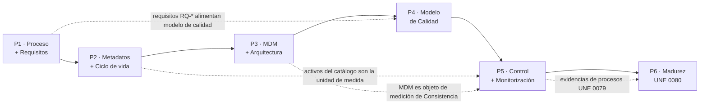

# Práctica Transversal — Gobierno y Calidad del Dato · EnergiTech

> **Asignatura:** Gobierno y Calidad del Dato — MUBDCN · UCLM 2025/26
> **Autor:** Alonso Marcos Muñoz
> **Defensa:** sesión 15 · 2026-05-14

---

## Descripción

Caso ficticio **EnergiTech**, multinacional de distribución de energía renovable con problemas crónicos de calidad del dato:

| Problema | Manifestación |
|---|---|
| Duplicidad de clientes | "Juan Pérez" registrado con 3 IDs distintos (luz, gas, mantenimiento) |
| Errores en previsiones | Informes de demanda energética incorrectos por datos sucios |
| Sin trazabilidad | Accesos a datos sensibles sin auditoría (RGPD/ENS) |

La solución se articula en **6 proyectos** que aplican los procesos UNE 0077/0078/0079/0080/0081 sobre el proceso de negocio núcleo: **cálculo de previsión de demanda energética**.

---

## Estructura del repositorio

```
TrabajoGobiernoCalidadDatos/
├── README.md                               ← este archivo
├── practicatransversal.md                  (enunciado — read-only)
├── guiadeestudio.md                        (calendario — read-only)
├── guiadocenteasignatura.md                (guía docente — read-only)
└── entregable/
    ├── 00-resumen-ejecutivo.md
    ├── 01-proyecto1-procesamiento-y-requisitos.md
    ├── 02-proyecto2-metadatos-y-ciclo-vida.md
    ├── 03-proyecto3-mdm-y-arquitectura.md
    ├── 04-proyecto4-medicion-calidad.md
    ├── 05-proyecto5-control-monitorizacion.md
    ├── 06-proyecto6-madurez-une0080.md
    ├── anexos/
    │   ├── glosario-negocio.md
    │   ├── catalogo-datos.md
    │   ├── diccionario-datos.md
    │   ├── matriz-requisitos.md
    │   ├── modelo-mdm-cliente.md
    │   ├── procedimientos-medicion.md
    │   └── plan-mejora-madurez.md
    └── defensa/
        └── presentacion.md                 (Marp → exportar a PDF)
```

---

## Proyectos

| # | Título | Norma principal | Entregable clave |
|---|---|---|---|
| P1 | Procesamiento y requisitos del dato | UNE 0078 3.1, 3.3, 3.4 | BPMN proceso previsión + matriz de requisitos |
| P2 | Metadatos y ciclo de vida | UNE 0078 3.7, UNE 0087 | 3 repositorios de metadatos + políticas de ciclo de vida |
| P3 | MDM y arquitectura de datos | UNE 0078 3.10 | Modelo MDM Cliente + arquitectura por capas |
| P4 | Medición de calidad del dato | UNE 0079, UNE 0081 | Modelo de calidad + métricas y umbrales |
| P5 | Control y monitorización | UNE 0079 3.2 | Procedimientos de medición + cuadro de mandos |
| P6 | Madurez UNE 0080 | UNE 0080 | Autoevaluación de madurez + plan de mejora |

---

## Trazabilidad entre proyectos



---

## Hallazgos principales

1. **Nivel de madurez actual: 2 (Gestionado)** con elementos del nivel 3 en gestión de calidad. Objetivo a 12–18 meses: nivel 3 transversal y nivel 4 en procesos críticos.
2. La mayor brecha de calidad es **Consistencia** (silos de cliente). El proyecto MDM (P3) es la palanca con mayor impacto.
3. La **trazabilidad de accesos** (RGPD/ENS) es prioritaria y se recoge en el plan de mejora (MEJ-08).
4. Los umbrales propuestos están alineados con el **apetito de riesgo** declarado: bajo en seguridad/regulación, medio en disponibilidad operativa.
5. Stack recomendado: **OpenMetadata + dbt-tests + Great Expectations + Airflow + MDM Hub** — cubre UNE 0078 3.7, 3.10 y UNE 0079 3.2 con herramientas mayoritariamente open-source.

---

## Marco normativo

| Norma | Alcance |
|---|---|
| UNE 0077:2023 | Gobierno del dato |
| UNE 0078:2023 | Gestión del dato (procesos NM1/NM2/NM3) |
| UNE 0079:2023 | Gestión de la calidad del dato |
| UNE 0080:2023 | Evaluación de madurez en gobierno, gestión y calidad |
| UNE 0081:2023 | Evaluación de calidad de un conjunto de datos |
| ISO/IEC 25012, 25024, 8000-x, 33000 | Calidad del dato — referencia internacional |
| DAMA-DMBOK 2.0 | Marco de gestión de datos empresarial |
