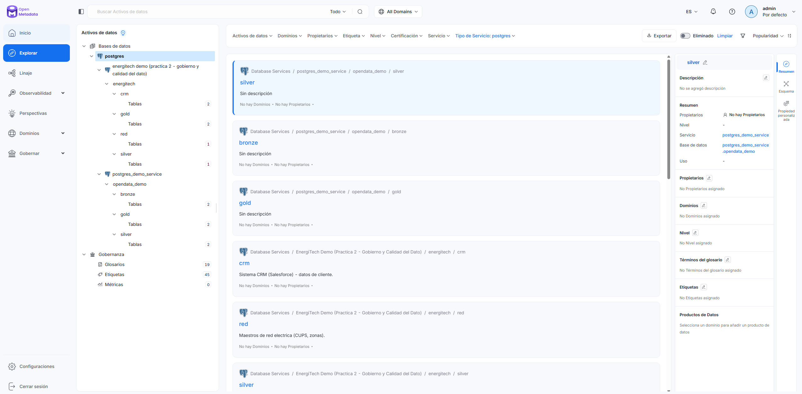
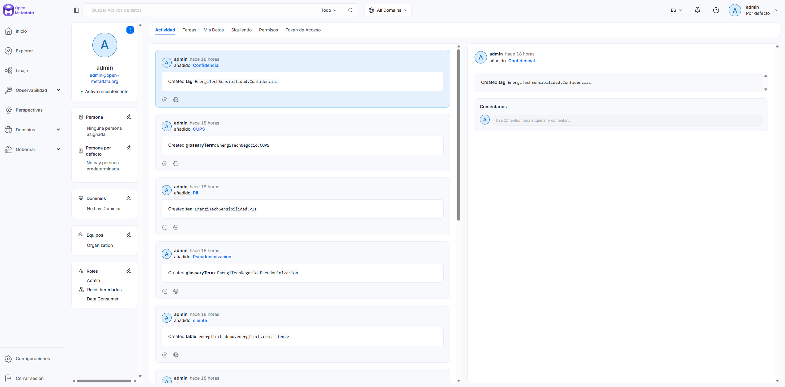

# Gobierno y Calidad del Dato sobre OpenMetadata · Caso EnergiTech (MUBDCN UCLM 2025/26)

> **Despliegue público:** [Abrir despliegue](https://alonsomarcosm.github.io/TrabajoGobiernoCalidadDatos/)

[AlonsoMarcosM/TrabajoGobiernoCalidadDatos](https://github.com/AlonsoMarcosM/TrabajoGobiernoCalidadDatos)

> Práctica Transversal de la asignatura **Gobierno y Calidad del Dato** del *Máster Universitario en Big Data y Computación en la Nube* (UCLM). Aplica los procesos **UNE 0077, 0078, 0079, 0080 y 0081** sobre un caso ficticio —**EnergiTech**, multinacional de distribución de energía renovable— y materializa el modelo simplificado en una instancia real de **OpenMetadata** desplegada en Kubernetes. Cada decisión de gobierno se acompaña de una evidencia visual reproducible.


---

## Tabla de contenidos

1. [Contexto y objetivo](#1-contexto-y-objetivo)
2. [Recorrido visual end-to-end](#2-recorrido-visual-end-to-end)
3. [Arquitectura del entregable](#3-arquitectura-del-entregable)
4. [Stack tecnológico](#4-stack-tecnológico)
5. [Características clave](#5-características-clave)
6. [Resultados del trabajo](#6-resultados-del-trabajo)
7. [Estructura del repositorio](#7-estructura-del-repositorio)
8. [Puesta en marcha](#8-puesta-en-marcha)
9. [Uso operativo](#9-uso-operativo)
10. [Modelo cargado en OpenMetadata](#10-modelo-cargado-en-openmetadata)
11. [Trazabilidad UNE ↔ entregables](#11-trazabilidad-une--entregables)
12. [Hallazgos y plan de mejora](#12-hallazgos-y-plan-de-mejora)
13. [Limitaciones y alcance académico](#13-limitaciones-y-alcance-académico)
14. [Autor](#14-autor)

---

## 1. Contexto y objetivo

**Asignatura:** Gobierno y Calidad del Dato — *Máster Universitario en Big Data y Computación en la Nube* (MUBDCN), Universidad de Castilla-La Mancha (UCLM), curso 2025-2026.

**Caso:** *EnergiTech*, distribuidora multinacional de energía renovable con tres problemas crónicos de calidad del dato:

| Problema raíz | Manifestación |
|---|---|
| **Duplicidad de clientes** entre silos | *Juan Pérez* registrado con 3 `IDCliente` distintos (Luz, Gas, Mantenimiento). |
| **Errores en informes y previsiones** | Cálculo de demanda energética con datos sucios. |
| **Sin trazabilidad de accesos** | RGPD / ENS sin evidencias auditables. |

**Aportación.** Seis proyectos transversales (P1–P6) que aplican los procesos UNE sobre el flujo de negocio núcleo —*cálculo de previsión de demanda*— y que se **materializan en OpenMetadata** mediante un modelo simplificado, scripts de carga/borrado idempotentes y evidencias visuales incrustadas en la memoria final.

**Diferenciador respecto a un trabajo "de papel".** El entregable no se queda en Markdown: el catálogo, el glosario, el linaje y las custom properties existen como entidades reales que pueden navegarse en una UI productiva y sirven de evidencia ejecutable durante el tribunal.

---

## 2. Recorrido visual end-to-end

| Etapa | Acción | Evidencia producida |
|---:|---|---|
| 1 | Levantar OpenMetadata (clúster Kubernetes del TFM, sin tocar el TFM). | UI accesible en `http://localhost:8585`. |
| 2 | Generar JWT de admin y exportarlo al entorno. | `$env:OM_TOKEN` con TTL 8 h. |
| 3 | Lanzar `insertar_energitech.py`. | Servicio `energitech-demo`, 1 db, 4 schemas, 6 tablas, 3 classifications, 1 glosario, 4 custom properties, 5 aristas de lineage. |
| 4 | Recorrer la UI de OpenMetadata y guardar las capturas de evidencia. | 17 capturas principales en `entregable/imágenes/openmetadata/` (+ 2 imágenes de apoyo `om-99-*`). |
| 5 | Compilar la memoria con todas las evidencias incrustadas. | Documentos finales para revisión. |
| 6 | (Limpieza) `borrar_energitech.py`. | OpenMetadata limpio; el TFM intacto. |

> 
>
> 

---

## 3. Arquitectura del entregable

| Bloque | Contenido |
|---|---|
| `entregable/` | Memoria principal, anexos y evidencias incrustadas. |
| `scripts/` | Carga, borrado, túnel local y token de OpenMetadata. |
| OpenMetadata | Servicio `energitech-demo`, base `energitech`, 4 schemas, 6 tablas, glosario, clasificaciones, custom properties y linaje. |
| `entregable/imágenes/` | Capturas de OpenMetadata e imágenes de apoyo usadas por la memoria. |

---

## 4. Stack tecnológico

| Capa | Tecnología | Razón |
|---|---|---|
| Redacción del entregable | **Markdown (CommonMark)** | Versionable, diffeable y revisable. |
| Catálogo de metadatos | **OpenMetadata 1.12** | Único metamodelo cubriendo glosario, catálogo, diccionario, tags, custom properties y lineage. |
| Orquestación del clúster | **Kubernetes + Helm + Kind** (reutiliza el clúster del TFM) | Zero coste, idéntico patrón al productivo. |
| Carga del modelo | **Python 3.10 + requests** | API REST de OpenMetadata, sin SDK pesado. |
| Helpers | **PowerShell 7** | Port-forward y generación de JWT. |

---

## 5. Características clave

- **Materialización real en OpenMetadata.** El modelo del trabajo —no solo un dibujo— vive en la herramienta que el profesor recomienda y puede recorrerse en la UI.
- **Aislamiento estricto del TFM.** Todas las entidades viven bajo el prefijo `energitech-demo` / `EnergiTech*` / `EnergiTechNegocio`. El script de borrado solo afecta a esos nombres exactos.
- **Reproducibilidad por scripts.** `insertar_energitech.py` y `borrar_energitech.py` cargan/limpian el modelo de forma idempotente.
- **Evidencias visuales.** Cada decisión de gobierno se acompaña de la captura correspondiente de OpenMetadata.
- **Trazabilidad UNE explícita.** Cada característica/proceso citado lleva su referencia (`UNE 00XX Y.Z`); las custom properties `UNE0078proceso` y `UNE0081caracteristica` cierran la trazabilidad documento ↔ herramienta.
- **Reducción de alcance pragmática.** Del caso original (16 activos, 7 dominios) al ejemplo cargable (6 tablas, 4 schemas, 19 términos) — suficiente para evidenciar los seis procesos sin ahogar a la audiencia.

---

## 6. Resultados del trabajo

| Entregable | Estado | Ubicación |
|---|---|---|
| Resumen ejecutivo | ✅ | [`entregable/00-resumen-ejecutivo.md`](entregable/00-resumen-ejecutivo.md) |
| P1 — Procesamiento y requisitos | ✅ | [`entregable/01-proyecto1-procesamiento-y-requisitos.md`](entregable/01-proyecto1-procesamiento-y-requisitos.md) |
| P2 — Metadatos y ciclo de vida | ✅ | [`entregable/02-proyecto2-metadatos-y-ciclo-vida.md`](entregable/02-proyecto2-metadatos-y-ciclo-vida.md) |
| P3 — MDM y arquitectura | ✅ | [`entregable/03-proyecto3-mdm-y-arquitectura.md`](entregable/03-proyecto3-mdm-y-arquitectura.md) |
| P4 — Medición de calidad | ✅ | [`entregable/04-proyecto4-medicion-calidad.md`](entregable/04-proyecto4-medicion-calidad.md) |
| P5 — Control y monitorización | ✅ | [`entregable/05-proyecto5-control-monitorizacion.md`](entregable/05-proyecto5-control-monitorizacion.md) |
| P6 — Madurez UNE 0080 | ✅ | [`entregable/06-proyecto6-madurez-une0080.md`](entregable/06-proyecto6-madurez-une0080.md) |
| Anexos (glosario, catálogo, diccionario, matrices...) | ✅ | [`entregable/anexos/`](entregable/anexos/) |
| Modelo cargable en OpenMetadata | ✅ | [`scripts/insertar_energitech.py`](scripts/insertar_energitech.py) |
| Capturas de OpenMetadata incrustadas | ✅ | [`entregable/imágenes/openmetadata/`](entregable/imágenes/openmetadata/) |

| Métrica del modelo cargado | Valor |
|---|---:|
| Database Services | 1 (`energitech-demo`) |
| Databases | 1 (`energitech`) |
| Schemas | 4 (`crm`, `red`, `silver`, `gold`) |
| Tablas | 6 |
| Columnas con tags | ~12 (PII en `crm.cliente`) |
| Classifications / Tags | 3 / 10 |
| Términos del glosario | 19 |
| Custom properties añadidas al tipo `table` | 4 |
| Aristas de lineage | 5 |

---

## 7. Estructura del repositorio

```text
TrabajoGobiernoCalidadDatos/
├── README.md                              ← este documento
├── practicatransversal.md                 ← enunciado oficial (read-only)
├── guiadeestudio.md                       ← calendario sesión 09–15 (read-only)
├── guiadocenteasignatura.md               ← guía docente (read-only)
├── scripts/
│   ├── README.md                          ← flujo recomendado paso a paso
│   ├── insertar_energitech.py             ← carga el modelo en OpenMetadata
│   ├── borrar_energitech.py               ← limpia EnergiTech-* (no toca TFM)
│   ├── port_forward_openmetadata.ps1      ← túnel local al servicio
│   ├── obtener_token_openmetadata.ps1     ← JWT admin (reutiliza generador del TFM)
└── entregable/
    ├── 00-resumen-ejecutivo.md
    ├── 01-…06-proyectoN-….md              ← 6 proyectos UNE
    ├── anexos/
    │   ├── glosario-negocio.md            ← 27 términos
    │   ├── catalogo-datos.md              ← 16 activos
    │   ├── diccionario-datos.md           ← 7 tablas detalladas
    │   ├── matriz-requisitos.md
    │   ├── modelo-mdm-cliente.md
    │   ├── procedimientos-medicion.md
    │   └── plan-mejora-madurez.md         ← 10 iniciativas, Gantt 12 m
    └── imágenes/                          ← diagramas y capturas manuales tras la carga
```

---

## 8. Puesta en marcha

### 8.1 Requisitos

- **Windows 10/11** con PowerShell.
- **Docker Desktop** activo y **clúster Kind del TFM** disponible (`tfm-om`).
- **Python 3.10+** con `requests`, `PyJWT`, `cryptography` (ya en `requirements-dev.txt` del TFM).
- **`kubectl`** en el `PATH` apuntando al contexto `kind-tfm-om`.

### 8.2 Pasos (en orden)

```powershell
# 1. Túnel local a OpenMetadata
powershell -ExecutionPolicy Bypass -File .\scripts\port_forward_openmetadata.ps1

# 2. JWT en una segunda terminal — TTL 8 h, listo para los scripts
powershell -ExecutionPolicy Bypass -File .\scripts\obtener_token_openmetadata.ps1 -SetEnv

# 3. Cargar el modelo EnergiTech
python .\scripts\insertar_energitech.py

# 4. Recorrer la UI y capturar las pantallas de evidencia

# 5. (Opcional) Limpiar OpenMetadata al terminar
python .\scripts\borrar_energitech.py
```

---

## 9. Uso operativo

### Como lector

- Abrir [`entregable/00-resumen-ejecutivo.md`](entregable/00-resumen-ejecutivo.md) para una visión de 5 minutos.
- Saltar al proyecto que interese (P1–P6). Cada decisión sobre OpenMetadata lleva su captura.
- Consultar los anexos para los productos de trabajo UNE en detalle.

### Como operario

1. Lanzar `port_forward_openmetadata.ps1`.
2. Comprobar que `insertar_energitech.py` está aplicado (en caso contrario, ejecutarlo: tarda ~10 s).
3. Recorrer la UI en directo: el linaje completo de `gold.prevision_demanda` resume la historia de P1 a P5.

### Como integrador (extender el modelo)

`insertar_energitech.py` está pensado para crecer: añadir nuevas tablas o tags al modelo es modificar las listas `TABLES`, `CLASSIFICATIONS` o `GLOSSARY_TERMS` y volver a ejecutar. La API REST devuelve idempotencia por `PUT`, así que las re-ejecuciones son seguras.

---

## 10. Modelo cargado en OpenMetadata

Modelo simplificado del caso, suficiente para evidenciar los seis procesos sin abrumar a la audiencia.

| Entidad | Nombre | Función |
|---|---|---|
| DatabaseService | `energitech-demo` | Aísla el caso del resto de servicios del clúster. |
| Database | `energitech` | Base lógica del caso. |
| Schema | `crm` | Sistema CRM (cliente, contrato). |
| Schema | `red` | Maestros de red eléctrica (CUPS, zonas). |
| Schema | `silver` | Capa Silver — dato limpio + pseudonimizado. |
| Schema | `gold` | Capa Gold — productos de dato publicables. |
| Tabla | `crm.cliente` | 8 columnas, 4 con tag PII. |
| Tabla | `crm.contrato` | 8 columnas, FK a `cliente` y `punto_suministro`. |
| Tabla | `red.punto_suministro` | 5 columnas, PK `cups`. |
| Tabla | `silver.lectura_smart_meter` | 6 columnas, lecturas depuradas. |
| Tabla | `gold.curva_carga_zona` | 3 columnas, agregado horario. |
| Tabla | `gold.prevision_demanda` | 7 columnas, **producto de datos PD-01**. |
| Classification | `EnergiTechSensibilidad` | Tags `PII`, `Confidencial`, `Interna`, `Publica`. |
| Classification | `EnergiTechCapa` | Tags `Bronze`, `Silver`, `Gold`. |
| Classification | `EnergiTechCriticidad` | Tags `Alta`, `Media`, `Baja`. |
| Glossary | `EnergiTechNegocio` | 19 términos del dominio Demanda. |
| Custom property | `UNE0078proceso` | Proceso UNE 0078 al que da evidencia el activo. |
| Custom property | `UNE0081caracteristica` | Característica de calidad UNE 0081 medida sobre el activo. |
| Custom property | `stewardEnergiTech` | Steward de negocio responsable. |
| Custom property | `capaMedallion` | Capa medallion (Bronze/Silver/Gold). |

Linaje cargado:

```
crm.cliente ──┐
              ├─→ crm.contrato
red.punto_suministro ─┘
red.punto_suministro ─→ silver.lectura_smart_meter ─→ gold.curva_carga_zona ─→ gold.prevision_demanda
```

---

## 11. Trazabilidad UNE ↔ entregables

| Norma | Procesos cubiertos | Documento |
|---|---|---|
| **UNE 0077** | Gobierno (estructura, roles, políticas) | Transversal: P2 4.4 + P5 4.5 + P6 |
| **UNE 0078** | 3.1, 3.3, 3.4, 3.7, 3.8, 3.9, 3.10, 3.12 | P1, P2, P3 (parcial 3.6 Seguridad) |
| **UNE 0079** | 3.1, 3.2, 3.4 | P4 (planificación inicial) y P5 |
| **UNE 0080** | Autoevaluación de madurez, plan de mejora | P6 |
| **UNE 0081** | Modelo de calidad, características, propiedades, medidas | P4 |
| **ISO/IEC 25012, 25024, 8000-x, 33000** | Referencia internacional | Referenciada en todos los proyectos |
| **DAMA-DMBOK 2.0**, **modelo MAMD** | Marco transversal | Referenciado en P3 y P6 |

---

## 12. Hallazgos y plan de mejora

1. **Nivel de madurez actual:** **2 (Gestionado)** con elementos del 3 en gestión de calidad. Objetivo a 12–18 meses: nivel 3 transversal y nivel 4 en procesos críticos de DQ.
2. La mayor brecha de calidad es **Consistencia** (caso "Juan Pérez"). El MDM (P3) es la palanca con mayor impacto.
3. La **trazabilidad de accesos** (RGPD/ENS) es la mejora con prioridad regulatoria (MEJ-08).
4. Los umbrales propuestos están alineados con el **apetito de riesgo** declarado: bajo en seguridad/regulación, medio en disponibilidad operativa.
5. Stack recomendado: **OpenMetadata + dbt-tests + Great Expectations + Airflow + MDM Hub** — cubre UNE 0078 3.7, 3.10 y UNE 0079 3.2 con piezas mayoritariamente *open-source*.

Plan de mejora completo (10 iniciativas, Gantt 12 m, ~670 k€): [`entregable/anexos/plan-mejora-madurez.md`](entregable/anexos/plan-mejora-madurez.md).

---

## 13. Autor

**Alonso Marcos Muñoz** — alonso.marcos@alu.uclm.es

*Máster Universitario en Big Data y Computación en la Nube* — Universidad de Castilla-La Mancha (UCLM).
Práctica Transversal de *Gobierno y Calidad del Dato*, curso 2025-2026.

- **Asignatura:** Gobierno y Calidad del Dato (MUBDCN).
- **TFM relacionado:** [Diseño y configuración de un modelo de metadatos en OpenMetadata conforme al estándar DCAT-AP](https://github.com/AlonsoMarcosM/TFM_Alonso_Marcos_Mu-oz).

---

> Trabajo académico. Toda la infraestructura corre localmente sobre Docker + Kind. Las entidades cargadas en OpenMetadata se aíslan por convención de nombres y pueden borrarse de forma reversible en cualquier momento.
