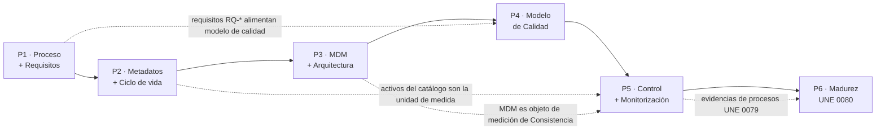

# Resumen Ejecutivo — Práctica Transversal "EnergiTech"

> **Autor:** Alonso Marcos Muñoz
> **Asignatura:** Gobierno y Calidad del Dato — MUBDCN UCLM 2025-26
> **Caso:** EnergiTech, multinacional de distribución de energía renovable.
> **Defensa:** sesión 15, 2026-05-14.

## 1. Problema y objetivo

EnergiTech presenta tres problemas crónicos:
1. **Duplicidad de clientes** entre silos (luz, gas, mantenimiento) — caso "Juan Pérez" con 3 IDs.
2. **Errores en informes y previsiones** de demanda energética.
3. **Sin trazabilidad** de los accesos a datos sensibles.

La iniciativa transversal del equipo de gobierno del dato encarga, como ejercicio académico exploratorio, **ejecutar seis proyectos** que apliquen los procesos definidos en las especificaciones UNE 0077, 0078, 0079, 0080 y 0081.

## 2. Estructura del entregable

```
entregable/
├── 00-resumen-ejecutivo.md            ← este documento
├── 01-proyecto1-procesamiento-y-requisitos.md
├── 02-proyecto2-metadatos-y-ciclo-vida.md
├── 03-proyecto3-mdm-y-arquitectura.md
├── 04-proyecto4-medicion-calidad.md
├── 05-proyecto5-control-monitorizacion.md
├── 06-proyecto6-madurez-une0080.md
├── anexos/
│   ├── glosario-negocio.md
│   ├── catalogo-datos.md
│   ├── diccionario-datos.md
│   ├── matriz-requisitos.md
│   ├── modelo-mdm-cliente.md
│   ├── procedimientos-medicion.md
│   └── plan-mejora-madurez.md
└── defensa/
    └── presentacion.md   (Marp → exportar a PDF)
```

## 3. Cobertura del enunciado

Mapeo de cada subapartado del [`practicatransversal.md`](../practicatransversal.md) contra los entregables generados.

| Apartado del enunciado | Sección en este entregable |
|---|---|
| §2.1 Descripción del proceso de previsión de demanda | [P1 §4.1](01-proyecto1-procesamiento-y-requisitos.md#41-descripción-del-proceso-de-negocio-cálculo-de-previsión-de-demanda-energética) |
| §2.2 Identificación de requisitos | [P1 §4.2](01-proyecto1-procesamiento-y-requisitos.md#42-identificación-de-requisitos-del-dato) + [matriz](anexos/matriz-requisitos.md) |
| §3.1 Repositorios de metadatos | [P2 §4.1](02-proyecto2-metadatos-y-ciclo-vida.md#41-creación-de-los-tres-repositorios-de-metadatos) + 3 anexos |
| §3.2 Ciclo de vida + políticas | [P2 §4.3 y §4.4](02-proyecto2-metadatos-y-ciclo-vida.md#43-gestión-del-ciclo-de-vida-del-dato) |
| §4.1 Modelo MDM Cliente | [P3 §4.1–4.3](03-proyecto3-mdm-y-arquitectura.md#41-creación-de-datos-maestros--modelo-conceptual-del-cliente) + [modelo MDM](anexos/modelo-mdm-cliente.md) |
| §4.2 Arquitectura de datos | [P3 §4.4](03-proyecto3-mdm-y-arquitectura.md#44-arquitectura-de-datos) |
| §5.1 Modelo de calidad | [P4 §4.1 y §4.2](04-proyecto4-medicion-calidad.md#41-selección-y-justificación-de-las-características-une-0081) |
| §5.2 Métodos de medición y umbrales | [P4 §4.3 y §4.4](04-proyecto4-medicion-calidad.md#43-métodos-de-medición) |
| §6.1 Procedimientos de medición | [P5 §4.2](05-proyecto5-control-monitorizacion.md#42-procedimientos-de-medición) + [anexo](anexos/procedimientos-medicion.md) |
| §7.1 Autoevaluación de madurez | [P6 §4](06-proyecto6-madurez-une0080.md#4-desarrollo) |
| §7.2 Plan de mejora | [P6 §5](06-proyecto6-madurez-une0080.md#5-plan-de-mejora) + [anexo](anexos/plan-mejora-madurez.md) |
| §8 Defensa | [`defensa/presentacion.md`](defensa/presentacion.md) |

## 4. Cobertura de los entregables esperados (§8 del enunciado)

| Entregable orientativo | Realizado en |
|---|---|
| Documento final con desarrollo de proyectos | Documentos 01–06 |
| Diagramas BPMN del proceso | P1 §4.1 |
| Plantilla / matriz de requisitos | [`matriz-requisitos.md`](anexos/matriz-requisitos.md) |
| Glosario de negocio | [`glosario-negocio.md`](anexos/glosario-negocio.md) |
| Catálogo de datos | [`catalogo-datos.md`](anexos/catalogo-datos.md) |
| Diccionario de datos | [`diccionario-datos.md`](anexos/diccionario-datos.md) |
| Modelo de datos maestros de Cliente | P3 §4.1 + [`modelo-mdm-cliente.md`](anexos/modelo-mdm-cliente.md) |
| Propuesta de arquitectura de datos | P3 §4.4 |
| Modelo de calidad del dato | P4 §4.2 |
| Procedimientos de medición | P5 §4.2 + [`procedimientos-medicion.md`](anexos/procedimientos-medicion.md) |
| Propuesta de monitorización / cuadro de mandos | P5 §4.3 y §4.4 |
| Autoevaluación de madurez UNE 0080 | P6 §4 |
| Plan de mejora | P6 §5 + [`plan-mejora-madurez.md`](anexos/plan-mejora-madurez.md) |
| Presentación para la defensa | [`defensa/presentacion.md`](defensa/presentacion.md) |

## 5. Trazabilidad inter-proyectos



## 6. Hallazgos principales

1. **Nivel de madurez actual**: 2 (Gestionado), con elementos del nivel 3 en gestión de calidad. Objetivo realista a 12–18 meses: **nivel 3 transversal** y **nivel 4 en procesos críticos de calidad**.
2. La característica con mayor brecha es **Consistencia** (silos de cliente). El proyecto MDM (P3) es la palanca con mayor impacto.
3. La **trazabilidad de accesos** (RGPD/ENS) es una mejora prioritaria que cae fuera del alcance académico pero se incluye en el plan (MEJ-08).
4. Los umbrales de calidad propuestos están **alineados con el apetito de riesgo** declarado: bajo en seguridad y regulación, medio en disponibilidad operativa.
5. La pila tecnológica recomendada (**OpenMetadata + dbt-tests + Great Expectations + Airflow + MDM Hub**) cubre los procesos UNE 0078 §3.7, §3.10 y UNE 0079 §3.2 con un único conjunto coherente y mayoritariamente *open-source*.

## 7. Referencias normativas

- UNE 0077:2023 — Gobierno del dato.
- UNE 0078:2023 — Gestión del dato.
- UNE 0079:2023 — Gestión de la calidad del dato.
- UNE 0080:2023 — Guía de evaluación de gobierno, gestión y calidad del dato.
- UNE 0081:2023 — Guía de evaluación de la calidad de un conjunto de datos.
- ISO/IEC 25012, 25024, 8000-x, 33000.
- DAMA-DMBOK 2.0; modelo MAMD.

## Control de versiones

| Versión | Fecha | Cambio |
|---|---|---|
| 1.0 | 2026-05-08 | Línea base completa de los 6 proyectos + anexos + defensa. |
