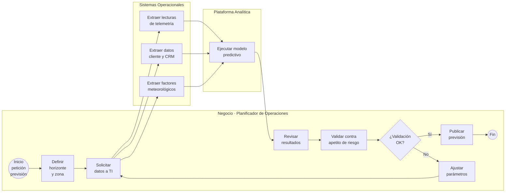
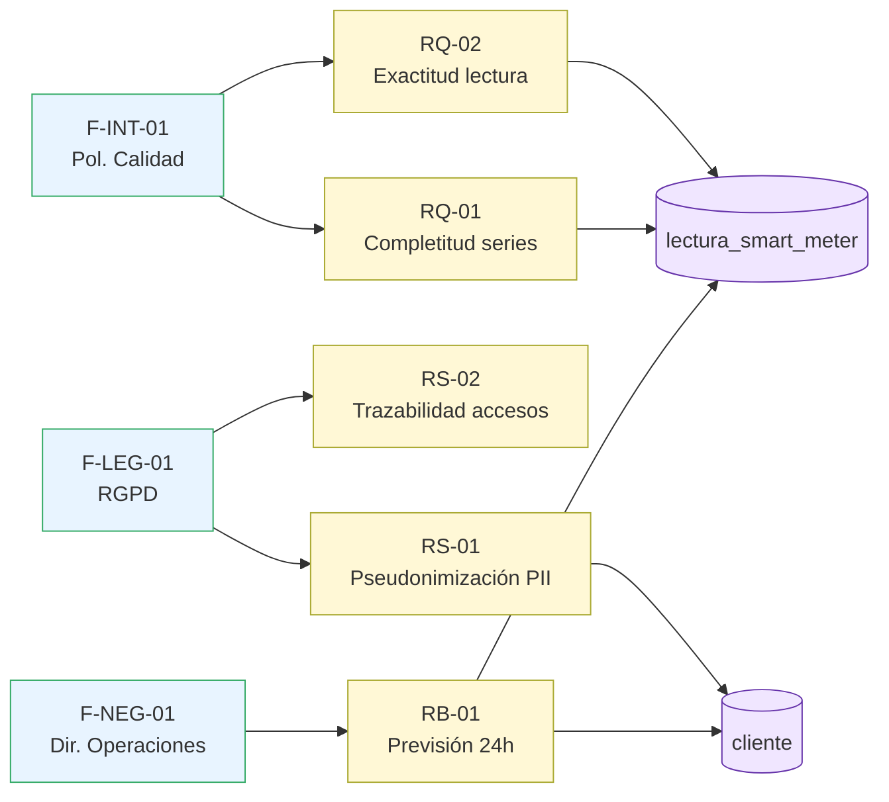

# Proyecto 1 — Procesamiento del Dato y Gestión de Requisitos

> **Autor:** Alonso Marcos Muñoz
> **Caso:** EnergiTech, multinacional de distribución de energía renovable que quiere implantar un sistema de **análisis predictivo de demanda energética** para garantizar la satisfacción de los clientes más críticos.
> **Sesión:** 09 — 2026-03-26
> **Procesos UNE 0078 aplicados:** 3.1 Procesamiento del dato · 3.3 Gestión de requisitos del dato · 3.4 Gestión de configuración del dato (Nota 3).

---

## 1. Objetivo y entregable

Modelar el proceso de negocio "Cálculo de previsión de demanda energética" y producir un catálogo inicial de requisitos del dato priorizado y trazable a las fuentes que los generan.

**Entregables tangibles del proyecto:**

| ID | Entregable | Ubicación |
|---|---|---|
| E1.1 | Modelo BPMN del proceso de negocio | §3.1 de este documento |
| E1.2 | Catálogo de actividades y datos por etapa | §3.2 de este documento |
| E1.3 | Matriz de requisitos del dato | [`anexos/matriz-requisitos.md`](anexos/matriz-requisitos.md) |
| E1.4 | Matriz de trazabilidad de requisitos | §4.4 de este documento |

## 2. Criterio de aceptación

- Cada actividad del proceso de negocio identifica los datos de entrada, los datos de salida y, al menos, una instrucción de procesamiento (UNE 0078 §3.1.1.3).
- El catálogo contiene ≥ 15 requisitos clasificados por tipo (negocio, dato, seguridad, calidad, infraestructura) y prioridad MoSCoW.
- Cada requisito declara fuente, propietario, criterio de aceptación y estado de implantación (UNE 0078 §3.3.1.4).
- Existe trazabilidad bidireccional fuente → requisito → dato afectado.

## 3. Marco normativo aplicado

| Apartado UNE | Aporte concreto a este proyecto |
|---|---|
| UNE 0078 §3.1.1.1–3.1.1.4 — Procesamiento del dato | Define las tareas (describir instrucciones de trabajo, generar resultados) y productos (instrucciones validadas, criterios de interpretación) que se modelan en el BPMN. |
| UNE 0078 §3.3.1.1–3.3.1.4 — Gestión de requisitos del dato | Aporta resultados de proceso (catálogo aprobado, trazabilidad) y productos de trabajo (listado de fuentes, matriz de trazabilidad). |
| UNE 0078 §3.4 — Gestión de configuración del dato | Soporta la versión y la integridad de los artefactos (Nota 3 del enunciado). Se aplica como anexo de control de versiones. |
| UNE 0078 §1.1 (13 procesos) | Encuadra el proyecto dentro del sistema de gestión del dato. |

---

## 4. Desarrollo

### 4.1 Descripción del proceso de negocio "Cálculo de previsión de demanda energética"

El proceso de negocio describe **cómo un planificador de operaciones de EnergiTech ejecuta la previsión** (no el algoritmo en sí). El enfoque es funcional, equivalente a "usar una función de Excel para calcular previsión" según el enunciado.

#### 4.1.1 Modelo BPMN (notación Mermaid)

Se simulan tres lanes (*Negocio*, *Sistemas Operacionales*, *Plataforma Analítica*) mediante `subgraph`:



**Leyenda:** S = evento de inicio, T*n* = tarea, D1 = compuerta exclusiva, E = evento fin.

#### 4.1.2 Catálogo de actividades — datos de entrada/salida e instrucciones de procesamiento

Sigue la estructura de UNE 0078 §3.1.2 (entradas, salidas, instrucciones de trabajo).

| Actividad | Datos de entrada | Datos de salida | Instrucción de procesamiento |
|---|---|---|---|
| T1 — Definir horizonte y zona | Petición de negocio, calendario, zonas de red | Parámetros de previsión (zona, horizonte, granularidad) | Validar zona contra catálogo de subestaciones; horizonte ≤ 168 h. |
| T2 — Solicitar datos a TI | Parámetros de previsión, política de acceso | Solicitud de extracción registrada | Generar ticket de extracción con SLA y firmar autorización RGPD si aplica. |
| T3 — Extraer lecturas | Tablas `lecturas_smart_meter` (15 min) | Series temporales de consumo por punto de suministro | Aplicar filtros de zona y rango; descartar lecturas marcadas con flag `anomaly=true`. |
| T4 — Extraer datos cliente | Tablas `cliente`, `contrato`, `tarifa` | Censo de clientes activos por zona | Filtrar contratos `estado=activo`; aplicar pseudonimización de PII (DNI, dirección). |
| T5 — Extraer meteo | API AEMET/proveedor, tablas `meteo_zona` | Series de temperatura, irradiancia, viento | Resampleo a granularidad horaria; imputar huecos < 2 h con interpolación lineal. |
| T6 — Ejecutar modelo | Series de consumo + meteo + censo | Curva prevista por zona y franja | Algoritmo *fuera de alcance* (caja negra desde gestión del dato). Registrar `model_id`, `version` y `run_id`. |
| T7 — Revisar resultados | Curva prevista, KPIs históricos | Dictamen preliminar | Comparar contra previsión-1d y MAPE histórico. |
| T8 — Validar vs. apetito de riesgo | Dictamen, umbral organizacional | Decisión publicar/ajustar | Umbral: MAPE ≤ 5 % residencial, ≤ 8 % industrial. |
| T9 — Publicar previsión | Curva validada | Producto de datos publicado en cuadro de mandos | Versionar y notificar a operaciones de red, comercializadora y atención al cliente. |
| T10 — Ajustar parámetros | Dictamen de rechazo | Nuevos parámetros de previsión | Documentar motivo y devolver a T2 (gestión de configuración, UNE 0078 §3.4). |

> Las actividades T1–T10 cubren los **resultados de proceso** declarados en UNE 0078 §3.1.1.2: definición/priorización de objetivos, instrucciones de trabajo, controles de validación y comunicación de resultados.

### 4.2 Identificación de requisitos del dato

Aplicación literal de UNE 0078 §3.3.1.3 (tareas):
1. **Identificar fuentes** de requisitos.
2. **Crear catálogo** validado y aprobado.
3. **Mantener trazabilidad** entre requisitos implantados y elementos del dato.

#### 4.2.1 Fuentes de requisitos identificadas

| Cód. fuente | Descripción | Prioridad fuente |
|---|---|---|
| F-NEG-01 | Dirección de Operaciones (sponsor del proyecto IA) | Alta |
| F-NEG-02 | Comercializadora — segmento residencial crítico | Alta |
| F-NEG-03 | Atención al cliente | Media |
| F-LEG-01 | Reglamento (UE) 2016/679 (RGPD) y LOPDGDD 3/2018 | Crítica (no negociable) |
| F-LEG-02 | Real Decreto 1110/2007 (medida eléctrica) | Alta |
| F-LEG-03 | Plan España Digital 2026 — Oficina del Dato | Media |
| F-INT-01 | Política interna de calidad del dato (UNE 0079) | Alta |
| F-INT-02 | Esquema Nacional de Seguridad (ENS) | Alta |
| F-TEC-01 | Inventario actual de infraestructura (DWH, smart meters) | Media |

#### 4.2.2 Catálogo de requisitos (resumen)

Catálogo completo y editable en [`anexos/matriz-requisitos.md`](anexos/matriz-requisitos.md). Resumen de tipos y volumen:

| Tipo | Nº requisitos | Ejemplo |
|---|---:|---|
| Negocio | 4 | RB-01: La previsión debe estar disponible para horizonte ≥ 24 h con frecuencia horaria. |
| Dato | 5 | RD-02: Toda lectura de smart-meter debe llevar `timestamp` UTC y `id_punto_suministro`. |
| Seguridad | 3 | RS-01: La PII debe estar pseudonimizada antes de cualquier explotación analítica (RGPD art. 32). |
| Calidad | 4 | RQ-01: Completitud de la serie de consumo ≥ 99 % en ventana de 30 días. |
| Infraestructura | 2 | RI-01: La plataforma analítica debe soportar 10⁹ lecturas/día con latencia ≤ 5 min. |

#### 4.2.3 Plantilla de campo por requisito

Cada entrada del catálogo recoge:

```
ID, Título, Descripción, Tipo, Fuente (F-…),
Prioridad MoSCoW (Must/Should/Could/Won't),
Propietario, Criterio de aceptación,
Datos asociados (referencia a catálogo de datos),
Estado de implantación (Identificado/Aprobado/Implantado/Retirado),
Versión, Fecha actualización
```

> Esta plantilla es la **descripción del producto de trabajo "Catálogo actualizado y validado de requisitos del dato con su prioridad establecida"** (UNE 0078 §3.3.1.4).

#### 4.2.4 Trazabilidad de requisitos



> Este grafo materializa la **matriz de trazabilidad de requisitos del dato** declarada como producto de trabajo en UNE 0078 §3.3.1.4.

### 4.3 Gestión de configuración (Nota 3)

Aplicación ligera de UNE 0078 §3.4:
- **Línea base 1.0** del catálogo de requisitos publicada al cierre de la sesión 09.
- Cualquier petición de cambio se registra con `ID-CR`, justificación, impacto y aprobador.
- Las versiones se reflejan en la cabecera de cada anexo (`Versión`, `Fecha`).

### 4.4 Decisiones y supuestos

- Se asume que la pseudonimización de PII se realiza **antes** de la entrada a la plataforma analítica (T3/T4 incluyen el control). Esto reduce el alcance de RGPD sobre los productos de datos descendentes.
- "Previsión de demanda" se entiende como producto de datos (no como modelo); el algoritmo concreto queda **fuera de alcance** (Nota 7 del enunciado, aplicable a este proyecto por consistencia).
- La granularidad mínima asumida es de 15 min (lecturas smart-meter) y la salida agregada al menos a granularidad horaria.

## 5. Trazabilidad con otros proyectos

| Proyecto destino | Elemento reutilizado |
|---|---|
| P2 (Metadatos y Ciclo de Vida) | Datos identificados en §4.1.2 alimentan el glosario, catálogo y diccionario. |
| P3 (MDM y Arquitectura) | Datos `cliente` y `contrato` motivan el modelo MDM Cliente. |
| P4 (Calidad) | Requisitos `RQ-*` definen las características UNE 0081 a evaluar. |
| P5 (Control DQ) | Umbral del apetito de riesgo (T8) → procedimientos de medición. |
| P6 (Madurez) | Evidencia de los procesos UNE 0078 §3.1, §3.3, §3.4. |

## 6. Referencias

- UNE 0078:2023 — *Gestión del Dato*, §3.1 Procesamiento del dato; §3.3 Gestión de requisitos del dato; §3.4 Gestión de configuración del dato.
- ISO 8000-61:2016 — *Data quality. Part 61: Data quality management: Process reference model*.
- RGPD (UE 2016/679) y LOPDGDD 3/2018 — base legal de RS-01, RS-02.
- Esquema Nacional de Seguridad (ENS) — base legal de RS-03.
