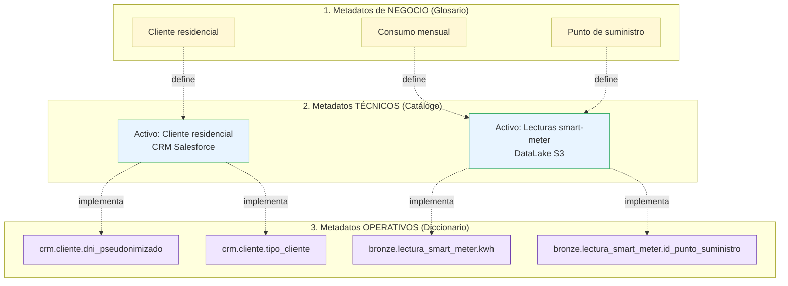
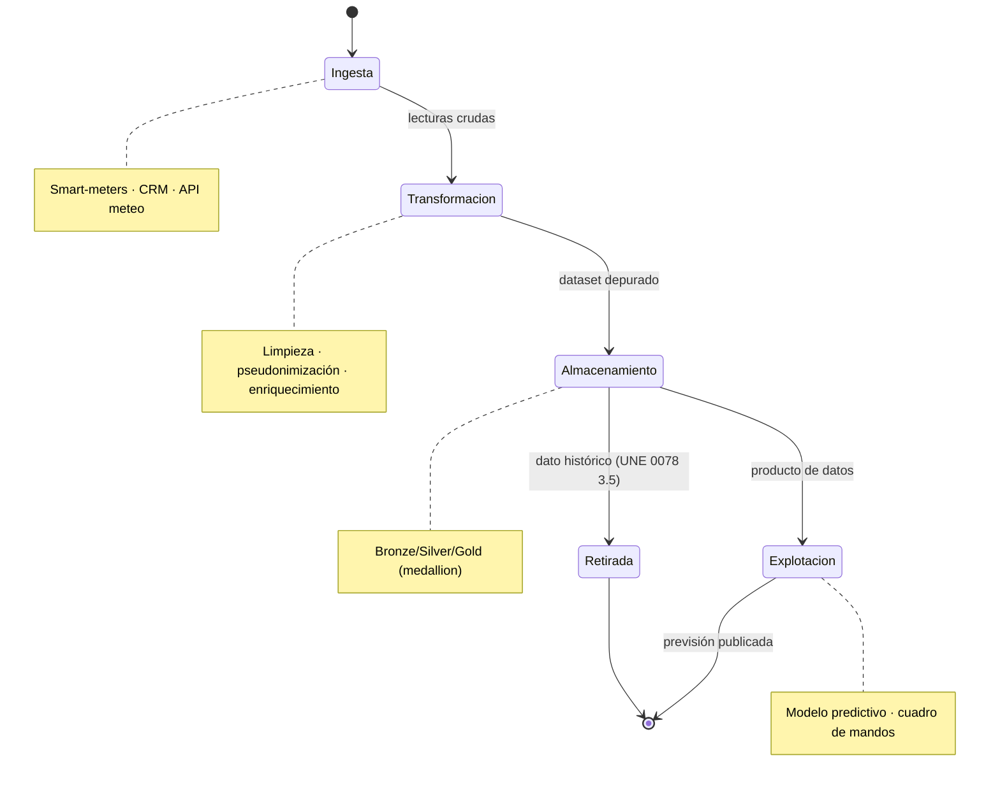
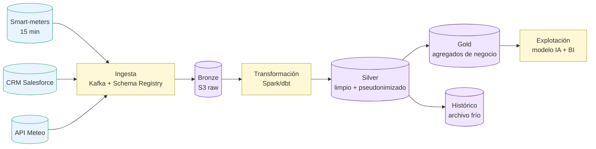

# Proyecto 2 — Gestión de Metadatos y Ciclo de Vida del Dato

> **Autor:** Alonso Marcos Muñoz
> **Contexto:** los trabajadores de EnergiTech carecen de un conocimiento homogéneo sobre los datos del proceso de previsión de demanda. Términos como *Cliente residencial* o *Consumo mensual* se interpretan de forma distinta entre departamentos.
> **Sesión:** 10 — 2026-04-09
> **Procesos UNE 0078 aplicados:** 3.7 Gestión del metadato · 3.12 Gestión del ciclo de vida del dato.
> **Marco complementario:** UNE 0087 (citada en el enunciado).

---

## 1. Objetivo y entregable

Construir tres repositorios reconciliados de metadatos —**glosario de negocio, catálogo de datos y diccionario de datos**— para el dominio de previsión de demanda, y describir el ciclo de vida del dato con sus controles y políticas.

| ID | Entregable | Ubicación |
|---|---|---|
| E2.1 | Glosario de negocio (≥ 25 términos del dominio) | [`anexos/glosario-negocio.md`](anexos/glosario-negocio.md) |
| E2.2 | Catálogo de datos (sistemas, tablas, propietarios, sensibilidad) | [`anexos/catalogo-datos.md`](anexos/catalogo-datos.md) |
| E2.3 | Diccionario de datos (campos físicos, tipos, restricciones, PII) | [`anexos/diccionario-datos.md`](anexos/diccionario-datos.md) |
| E2.4 | Diagrama de trazabilidad de los tres tipos de metadatos | 4.2 de este documento |
| E2.5 | Modelo de ciclo de vida y controles de validación | 4.3 de este documento |
| E2.6 | Mapa de políticas de uso del dato | 4.4 de este documento |

## 2. Criterio de aceptación

- Los tres repositorios contienen, como mínimo, el conjunto de datos identificado en P1 4.1.2.
- Cada término de negocio enlaza con al menos una entrada del catálogo y con uno o más campos del diccionario.
- El ciclo de vida cubre las cuatro fases del enunciado (`Ingesta → Transformación → Almacenamiento → Explotación`) y declara controles por fase.
- Existe una propuesta de herramienta (OpenMetadata) con justificación funcional (Nota 4).

## 3. Marco normativo aplicado

| Apartado UNE | Aporte concreto |
|---|---|
| UNE 0078 3.7.1 — Gestión del metadato | Define los **tres tipos de metadatos** (negocio, técnico, operativo) que estructuran este proyecto. |
| UNE 0078 3.7.1.4 — Productos de trabajo | Lista los repositorios poblados (glosario, catálogo, diccionario) que constituyen los entregables E2.1–E2.3. |
| UNE 0078 3.12 — Gestión del ciclo de vida del dato | Aporta resultados de proceso: identificación de etapas, políticas, controles y monitorización. |
| ISO/IEC 11179 (referida en 3.7.3) | Marco normativo para registro de metadatos. |
| ISO/IEC 25012 / 25024 (referidas en 3.7.3 y 3.12.3) | Calidad y modelos de ciclo de vida del dato. |
| UNE 0087 (citada en el enunciado) | Tres tipos de metadatos: negocio / técnico / operativo. |

---

## 4. Desarrollo

### 4.1 Creación de los tres repositorios de metadatos

Aplicación literal de UNE 0078 3.7.1.3, tarea *"Poblar los repositorios del metadato"*.

#### 4.1.1 Repositorio 1 — Glosario de negocio (metadatos de negocio)

Función: **definir qué significa cada término** desde la perspectiva del negocio.

Atributos de cada entrada (alineados con ISO/IEC 11179):
`Término · Definición · Sinónimos · Dueño de negocio · Dominio · Estado de aprobación · Versión`.

Ejemplo (fragmento):

| Término | Definición | Dueño | Estado |
|---|---|---|---|
| Cliente residencial | Persona física titular de un contrato de suministro doméstico < 15 kW. | Comercializadora | Aprobado |
| Consumo mensual | Suma de la energía activa demandada (kWh) por un punto de suministro durante un mes natural. | Operaciones | Aprobado |
| Punto de suministro | Lugar físico identificado por CUPS donde se entrega la energía. | Operaciones | Aprobado |

> Glosario completo (≥ 25 términos) en [`anexos/glosario-negocio.md`](anexos/glosario-negocio.md).

**Herramientas recomendadas:** Collibra (DGC), Atlan, Alation, **OpenMetadata** (Nota 4 → opción seleccionada por *open-source* y por integrar los tres tipos en un solo metamodelo).

#### 4.1.2 Repositorio 2 — Catálogo de datos (metadatos técnicos)

Función: **localizar los datos** (qué sistema, esquema, tabla los almacena).

Atributos: `Activo de datos · Sistema · Esquema · Tabla · Propietario técnico · Sensibilidad · Frecuencia de actualización · Lineage`.

| Activo | Sistema | Tabla | Propietario | Sensibilidad |
|---|---|---|---|---|
| Lecturas smart-meter | DataLake AWS S3 | `bronze.lectura_smart_meter` | CTO | Interna (PII pseudonimizada) |
| Cliente residencial | CRM Salesforce | `crm.cliente` | Comercializadora | Confidencial (PII) |
| Meteo zonal | API + DataLake | `bronze.meteo_zona` | CTO | Pública |

> Catálogo completo en [`anexos/catalogo-datos.md`](anexos/catalogo-datos.md).

**Herramientas recomendadas:** Apache Atlas, AWS Glue Data Catalog, **OpenMetadata** (integrado).

#### 4.1.3 Repositorio 3 — Diccionario de datos (metadatos operativos)

Función: **describir cómo está implementado** cada dato (campo, tipo, restricciones).

Atributos: `Tabla · Campo · Tipo SQL · Nullable · PK/FK · Restricciones · PII · Origen`.

| Tabla | Campo | Tipo | PK/FK | Restricciones | PII |
|---|---|---|---|---|:---:|
| `lectura_smart_meter` | `id_punto_suministro` | VARCHAR(22) | FK | NOT NULL · CUPS válido | No |
| `lectura_smart_meter` | `timestamp_utc` | TIMESTAMP | — | NOT NULL · UTC | No |
| `cliente` | `dni_pseudonimizado` | CHAR(64) | PK | SHA-256 (DNI + sal) | Sí (pseudonimizada) |

> Diccionario completo en [`anexos/diccionario-datos.md`](anexos/diccionario-datos.md).

**Herramientas recomendadas:** dbt-docs, Schemachange, **OpenMetadata** (mismo metamodelo).

> **Decisión sobre herramienta única (Nota 4):** se recomienda **OpenMetadata** porque integra los tres tipos en un metamodelo común, soporta lineage automático, ofrece API GraphQL, gestiona perfiles de calidad (alineado con P5) y es *open-source*, lo que evita silos de gobernanza y reduce el coste de licencias.

### 4.2 Trazabilidad entre los tres tipos de metadatos

> Cada relación se materializa en OpenMetadata mediante referencias `glossaryTerm ↔ table ↔ column`, cubriendo el resultado de proceso *"Establecer las relaciones entre los metadatos"* (UNE 0078 3.7.1.3).

### 4.3 Gestión del ciclo de vida del dato

Aplicación literal de UNE 0078 3.12.1.2 (resultados) y 3.12.1.3 (tareas).

#### 4.3.1 Modelo del ciclo de vida (cuatro fases del enunciado)

#### 4.3.2 Controles por fase (resultado de UNE 0078 3.12.1.2)

| Fase | Controles de validación | Reglas concretas (caso EnergiTech) |
|---|---|---|
| **Ingesta** | Esquema, completitud técnica, autenticación de origen | Validar `CUPS` (regex), `timestamp_utc` no nulo, lectura ≥ 0; rechazar lotes sin firma del *gateway*. |
| **Transformación** | Reglas de negocio, pseudonimización, deduplicación, controles de calidad | Pseudonimizar PII (RS-01); deduplicar por (`id_punto_suministro`, `timestamp_utc`); imputar gaps < 2 h por interpolación; flag `anomaly` por reglas RQ-01/RQ-02. |
| **Almacenamiento** | Particionado, versionado, control de acceso (RBAC), retención | Particionar por fecha; conservar bronze 90 d, silver 2 a, gold 7 a; cifrar a reposo (AES-256). |
| **Explotación** | Auditoría de acceso, validación contractual, certificación de DQ | Log de cada consulta (RS-02); el modelo predictivo solo accede a columnas marcadas `safe_for_analytics=true`. |
| **Retirada** | Plan de retención, anonimización irreversible, certificación de borrado | Aplicar UNE 0078 3.5 *Gestión del dato histórico*; anonimizar tras retención y registrar evidencia. |

#### 4.3.3 Diagrama de flujo entre repositorios

### 4.4 Políticas asociadas al ciclo de vida

UNE 0078 3.12.1.2 exige *"identificar las políticas que deben aplicarse al dato en cada etapa, así como los controles asociados"*. Mapa propuesto:

| Política | Lo que se puede hacer | Lo que NO se puede hacer | Restricciones / etapa |
|---|---|---|---|
| **POL-PII-01** Tratamiento de PII | Pseudonimizar para uso analítico interno. | Compartir DNI o dirección con terceros sin consentimiento. | Aplica a Transformación, Almacenamiento y Explotación. |
| **POL-RET-01** Retención de lecturas | Conservar lecturas crudas 90 días en bronze. | Conservar lecturas crudas con PII más allá del plazo legal (mín. 4 años, RD 1110/2007). | Almacenamiento → Retirada. |
| **POL-ACC-01** Acceso a datos sensibles | Acceso por roles con justificación de propósito. | Acceso directo a tablas crudas desde herramientas BI. | Almacenamiento, Explotación. |
| **POL-USE-01** Uso analítico | Entrenar modelos solo con capa silver pseudonimizada. | Reidentificar individuos a partir de agregados. | Explotación. |
| **POL-DQ-01** Calidad mínima publicable | Publicar previsión solo si las medidas de calidad superan los umbrales del proyecto P4/P5. | Publicar previsión cuando completitud < 99 % o exactitud < 98 %. | Explotación. |

### 4.5 Gestión del propio metadato como activo

UNE 0078 3.7.1.2 indica que el metadato debe **publicarse** y fomentarse su uso. Plan operativo mínimo:

- Publicación: portal interno de catálogo (OpenMetadata).
- Roles: cada término tiene un *steward* del dato responsable del mantenimiento.
- Calidad del metadato: cobertura ≥ 95 % de los datos críticos identificados en P1.
- Frecuencia de revisión: trimestral.

## 5. Trazabilidad con otros proyectos

| Proyecto destino | Reutilización |
|---|---|
| P3 (MDM/Arquitectura) | El catálogo y el diccionario alimentan el modelo MDM Cliente y la arquitectura de datos. |
| P4 (Calidad) | Los términos del glosario son la unidad de medida para las características UNE 0081. |
| P5 (Control DQ) | El catálogo de datos identifica los activos donde se ejecutan los procedimientos. |
| P6 (Madurez) | Evidencias de los procesos UNE 0078 3.7 y 3.12. |

## 6. Decisiones y supuestos

- Se elige el patrón **medallion (bronze/silver/gold)** por su trazabilidad explícita con las fases de UNE 0078 3.12 y por su uso extendido en plataformas Lakehouse.
- Se asume que el catálogo de datos ya cubre los sistemas operacionales legados (luz, gas, mantenimiento) que originan la duplicidad de clientes (input para P3).
- OpenMetadata se selecciona como herramienta única para los tres repositorios, sustituyendo enfoques de Excel + ficheros sueltos que no escalan.

## 7. Referencias

- UNE 0078:2023 — 3.7 Gestión del metadato; 3.12 Gestión del ciclo de vida del dato; 3.5 Gestión del dato histórico.
- UNE 0087 — Gestión de metadatos.
- ISO/IEC 11179 — *Information technology – Metadata registries (MDR)*.
- ISO/IEC 25012:2008 — *Software product Quality Requirements and Evaluation (SQuaRE) — Data quality model*.
- ISO/IEC 25024:2015 — *Measurement of data quality*.
