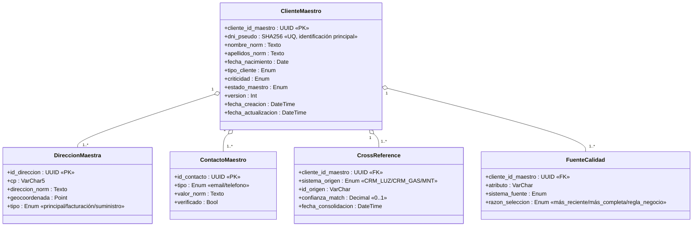
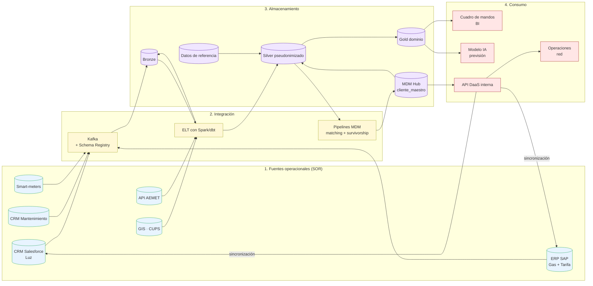

# Proyecto 3 — Gestión de Datos Maestros (MDM) y Arquitectura y Diseño de Datos

> **Autor:** Alonso Marcos Muñoz
> **Contexto:** EnergiTech tiene silos de datos heredados (negocio de luz, gas y mantenimiento) creados como bases de datos independientes en distintos momentos. El cliente *"Juan Pérez"* aparece registrado con tres `IDCliente` diferentes pese a tratarse de la misma persona. Esto provoca duplicidad, ambigüedad y pérdida de confianza.
> **Sesión:** 11 — 2026-04-16
> **Procesos UNE 0078 aplicados:** 3.10 Gestión del dato maestro · 3.8 Gestión de la arquitectura y diseño del dato · 3.9 Compartición, intermediación e integración del dato (mecanismos ETL/ELT).

---

## 1. Objetivo y entregable

Definir un **modelo de datos maestros para la entidad Cliente** y proponer una **arquitectura de datos** que garantice la consolidación, sincronización y consumo del dato unificado en los procesos analíticos (incluida la previsión de demanda del P1).

| ID | Entregable | Ubicación |
|---|---|---|
| E3.1 | Modelo conceptual del Cliente Maestro y su jerarquía | 4.1 + [`anexos/modelo-mdm-cliente.md`](anexos/modelo-mdm-cliente.md) |
| E3.2 | Estrategia de matching y *golden record* | 4.2 |
| E3.3 | Identificación del SOR (System of Records) y datos de referencia | 4.3 |
| E3.4 | Arquitectura de datos integrada con MDM | 4.4 |
| E3.5 | Patrón de integración y políticas de sincronización | 4.5 |

## 2. Criterio de aceptación

- El modelo MDM identifica al menos los atributos de **identificación**, **matching** y **enriquecimiento** del Cliente.
- Se declara la **fuente de verdad** por atributo (golden record) y los **datos de referencia** transversales.
- La arquitectura cubre las cuatro capas Fuentes → Integración → Almacenamiento → Consumo y se alinea con el ciclo de vida de P2.
- El estilo arquitectónico MDM elegido se justifica frente a alternativas (registro / persistente / híbrido).

## 3. Marco normativo aplicado

| Apartado UNE | Aporte concreto |
|---|---|
| UNE 0078 3.10 — Gestión del dato maestro | Define resultados (modelo, repositorio, golden record, calidad), tareas (identificación, consolidación, publicación) y productos (modelo, plan de consolidación, mecanismos de control). |
| UNE 0078 3.8 — Gestión de la arquitectura y diseño del dato | Pide modelos conceptual / lógico / físico y revisión de la infraestructura tecnológica. |
| UNE 0078 3.9 — Compartición, intermediación e integración del dato | Aporta los mecanismos ETL/ELT y los acuerdos de nivel de servicio para la consolidación MDM. |
| UNE 0078 3.6 — Gestión de seguridad del dato | RGPD/ENS aplicados a PII identificativa del cliente. |
| ISO 8000-100 a 8000-150 | Familia *Master data: Exchange of characteristic data*: provenance, accuracy, completeness, identifiers. |
| ISO/IEC 25012 / 25024 | Calidad de la información del repositorio maestro. |

---

## 4. Desarrollo

### 4.1 Creación de datos maestros — Modelo conceptual del Cliente

UNE 0078 3.10.1.3, tarea *"Identificar los datos maestros y sus jerarquías"* y *"Definir y aprobar un modelo conceptual del dato maestro"*.

#### 4.1.1 Modelo conceptual

#### 4.1.2 Clasificación de atributos

Siguiendo la práctica MDM extendida (DAMA-DMBOK 2.0 + UNE 0078 3.10):

| Categoría | Atributos | Función |
|---|---|---|
| **Identificación** | `dni_pseudo`, `cliente_id_maestro` | Identifican unívocamente a la persona/jurídica. |
| **Matching** | `nombre_norm + apellidos_norm + fecha_nacimiento + direccion_norm` | Sirven para resolución de entidad cuando falta DNI o el DNI difiere. |
| **Atributos descriptivos** | `tipo_cliente`, `criticidad`, contactos, dirección | Atributos de negocio reutilizables. |
| **Atributos de control** | `version`, `fecha_actualizacion`, `estado_maestro` | Versionado y auditoría. |
| **Cross-references** | `sistema_origen → id_origen` | Mantienen el vínculo con cada silo (luz, gas, mantenimiento). |

#### 4.1.3 Jerarquías

- **Por tipo de cliente**: `residencial` → `cliente`; `empresa` → `grupo empresarial` → `cliente`.
- **Por criticidad**: `crítico` → `media` → `baja`.
- **Geográfica**: `nacional` → `comunidad autónoma` → `zona de red` → `cliente`.

> Detalles ampliados (atributos completos, reglas de negocio, criterios de calidad por atributo) en [`anexos/modelo-mdm-cliente.md`](anexos/modelo-mdm-cliente.md).

### 4.2 Estrategia de matching y golden record

#### 4.2.1 Algoritmo de matching (resolución de entidad)

UNE 0078 3.10.1.3 → *"Resolver los conflictos que puedan existir entre los elementos de distintos registros del sistema de registro (record linkage) mediante la implementación de técnicas de resolución de entidad (entity resolution)"*.

**Pipeline propuesto** (en SparkML / Splink):

1. **Normalización**: pasar a minúsculas, eliminar tildes, regex de teléfonos a E.164, direcciones contra el `ref.codigo_postal`.
2. **Bloqueo (*blocking*)**: agrupar candidatos por `cp + soundex(apellido)` para evitar comparar 5·10⁶ × 5·10⁶ pares.
3. **Comparación atributo a atributo** con métricas:
   - DNI normalizado → exact match.
   - Nombre y apellidos → Jaro-Winkler ≥ 0,90.
   - Fecha de nacimiento → exact match (tolerancia ±1 día por errores de captura).
   - Dirección normalizada → similitud Levenshtein ≥ 0,85.
   - Teléfono → exact match en E.164.
4. **Score combinado** (Fellegi-Sunter): `score = Σ wᵢ · simᵢ`. Umbrales:

   | Score | Decisión |
   |---|---|
   | ≥ 0,92 | *Auto-merge* (golden record único). |
   | 0,75 – 0,91 | *Stewardship review* (cola para *data steward*). |
   | < 0,75 | *No-match*. |

5. **Persistencia** del enlace en `CrossReference` con `confianza_match`.

#### 4.2.2 Construcción del Golden Record

Estrategia **survivorship rules** atributo a atributo:

| Atributo | Regla de selección | Sistema preferido |
|---|---|---|
| DNI | El más reciente y verificado | CRM Salesforce |
| Nombre/Apellidos | Versión más completa (sin truncados) | CRM Salesforce |
| Fecha de nacimiento | El más antiguo registrado (raramente se inventa hacia atrás) | CRM Salesforce |
| Dirección de suministro | Tomado del GIS/ERP por CUPS | GIS |
| Email | El más recientemente verificado | CRM Salesforce |
| Teléfono | El más recientemente verificado | CRM Salesforce |
| Criticidad | Máximo entre los sistemas (regla conservadora) | Comercializadora |
| Tarifa actual | Última activa | ERP SAP |

> La regla y la fuente quedan registradas en la tabla `FuenteCalidad` para trazabilidad (UNE 0078 3.10.1.4 — *Informes periódicos del nivel de calidad del dato del repositorio maestro*).

### 4.3 Sistema de Registros (SOR) y datos de referencia

#### 4.3.1 SOR propuesto

| Dominio | SOR (fuente de verdad) | Justificación |
|---|---|---|
| Cliente identificativo | **CRM Salesforce** | Es el origen de altas comerciales y validación KYC. |
| Contrato y tarifa | **ERP SAP** | Cumple obligaciones contables y fiscales. |
| Punto de suministro | **GIS** | Mantiene la geometría legal del CUPS. |
| Lectura | **Sistema de telemetría** (smart-meters) | Origen físico de la medida. |
| Cliente Maestro | **MDM Hub** (nuevo) | Reconcilia los anteriores y publica un Golden Record. |

#### 4.3.2 Datos de referencia (no son maestros pero los acompañan)

| Conjunto | Origen externo | Frecuencia |
|---|---|---|
| Códigos postales | INE | Anual |
| Tipos de tarifa | CNMC | Anual / cuando publique cambios |
| Códigos CNAE (clasificación de empresas) | INE | Anual |
| Calendario de festivos | Boletines oficiales | Anual |
| Códigos ENTSO-E de zonas | ENTSO-E | Anual |

> Distinguimos **dato maestro** (entidad clave del negocio: Cliente, Producto, Activo) frente a **dato de referencia** (conjunto cerrado de valores compartidos), siguiendo la nomenclatura de UNE 0078 3.10.1.2.

### 4.4 Arquitectura de datos

UNE 0078 3.8.1.2 — modelos conceptual / lógico / físico y revisión de infraestructura.

#### 4.4.1 Estilo arquitectónico MDM elegido

| Estilo | Característica | Idoneidad EnergiTech |
|---|---|---|
| Registro | El MDM mantiene solo claves cruzadas; los datos siguen en los SOR. | Bajo coste pero no resuelve el problema de calidad: descartado. |
| Transaccional / persistente | El MDM mantiene los datos completos y es la fuente de verdad operativa. | Implica reescribir aplicaciones de negocio: alto coste y riesgo. |
| **Coexistencia (híbrido)** ✅ | El MDM publica el Golden Record y propaga cambios bidireccionalmente con los SOR. | **Seleccionado**: respeta los sistemas legados, mejora la calidad y reduce duplicidad. |

#### 4.4.2 Diagrama de la arquitectura

#### 4.4.3 Capas y responsabilidad (modelos conceptual/lógico/físico)

| Capa | Modelo | Tecnología sugerida |
|---|---|---|
| Fuentes | Conceptual: entidades de cada sistema legado | Salesforce, SAP, GIS Esri, Kaa/MQTT brokers |
| Integración | Lógico: contratos de evento, esquemas Avro/Protobuf | Apache Kafka + Schema Registry, dbt, Apache Airflow |
| Almacenamiento | Físico: medallion + MDM Hub | AWS S3 + Lakehouse (Iceberg/Delta) + Snowflake / Reltio / Informatica MDM |
| Consumo | Lógico: capa semántica (cubo) | dbt-metrics, Power BI, MLflow + servicio de previsión |

#### 4.4.4 Soporte al ciclo de vida y a la analítica (Nota 7)

La arquitectura no implementa el modelo predictivo, pero sí garantiza el **soporte completo al ciclo de vida** definido en P2:
- **Ingesta**: Kafka + ETL desde GIS y AEMET.
- **Transformación**: pipelines Spark/dbt; pipeline MDM dedicado.
- **Almacenamiento**: medallion + MDM Hub + datos de referencia.
- **Explotación**: API DaaS y capa Gold consumida por el modelo IA y BI.
- **Retirada**: política de retención por capa (definida en P2 4.4).

### 4.5 Integración y políticas de sincronización

UNE 0078 3.9 + 3.6.

| Política | Decisión |
|---|---|
| Patrón de propagación | *Hub-and-spoke*: el MDM Hub es la pieza central; las apps consumen vía API DaaS. |
| Latencia objetivo | CDC (Change Data Capture) con latencia ≤ 5 min entre SOR y MDM. |
| Resolución de conflictos | Reglas de *survivorship* (4.2.2). En empate, prevalece la fuente con mayor calidad histórica medida por P5. |
| Seguridad | Acceso por API a través de pasarela con OAuth2 y registro en SIEM (RS-02). |
| Calidad mínima publicable | Publicar `cliente_maestro` solo cuando completitud ≥ 99 % en atributos *Must* del catálogo de requisitos. |
| Versionado | SCD tipo 2 sobre `cliente_maestro` con historial completo y `version` incremental. |

## 5. Trazabilidad con otros proyectos

| Proyecto | Conexión |
|---|---|
| P1 | El proceso "Cálculo de previsión" (T4) consume `cliente` desde el MDM publicado vía API. |
| P2 | El catálogo y diccionario añaden la entrada `mdm.cliente_maestro` derivada de este proyecto. |
| P4 | Las características de calidad UNE 0081 se medirán sobre `mdm.cliente_maestro` además de las tablas raw. |
| P5 | Procedimientos de monitorización aplicados al MDM Hub. |
| P6 | Evidencias de los procesos UNE 0078 3.10, 3.8, 3.9. |

## 6. Decisiones y supuestos

- **Estilo MDM coexistencia**: balance pragmático entre calidad y coste de migración para una organización con sistemas legados muy heterogéneos.
- **Pseudonimización en frontera**: el MDM almacena `dni_pseudo` (SHA-256 con sal organizativa). El DNI en claro vive solo en el SOR (CRM Salesforce) bajo control de DPO/CISO.
- **Lakehouse como sustrato**: separa cómputo y almacenamiento, soporta los volúmenes de telemetría (10⁹ filas/día) y permite tanto SQL analítico como ML.
- Se asume que la organización dispone de capacidad para una iteración inicial limitada al dominio Cliente (Nota 7: el método analítico no se modela aquí).

## 7. Referencias

- UNE 0078:2023 — 3.10 Gestión del dato maestro; 3.8 Gestión de la arquitectura y diseño del dato; 3.9 Compartición, intermediación e integración del dato.
- ISO 8000-100/110/120/130/140 — *Master data: Exchange of characteristic data*.
- DAMA-DMBOK 2.0 — Capítulos 9 (Reference & Master Data) y 4 (Data Architecture).
- Fellegi & Sunter (1969) — *A Theory for Record Linkage*.
