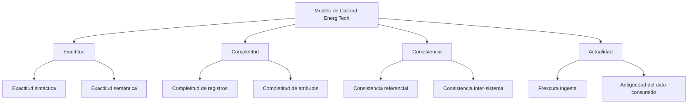
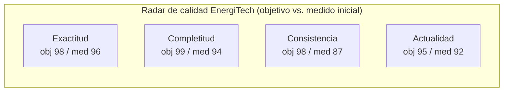

# Proyecto 4 — Medición de la Calidad del Dato

> **Autor:** Alonso Marcos Muñoz
> **Contexto:** los datos del proceso de previsión de demanda son conocidos por su **calidad inadecuada**: errores en informes, predicciones poco fiables, desconfianza de los trabajadores. El proyecto define un modelo de calidad que permita decidir si esos datos son aptos para soportar el proceso de negocio.
> **Sesión:** 12 — 2026-04-23
> **Especificaciones aplicadas:** UNE 0081 (modelo y proceso de evaluación), UNE 0079 (procesos de gestión de calidad), ISO/IEC 25012 (características).

---

## 1. Objetivo y entregable

Crear un **modelo de calidad de datos** sobre los activos clave de EnergiTech (lecturas, cliente, meteo, MDM) y definir las **medidas y umbrales** que permiten medir su nivel actual frente al apetito de riesgo.

| ID | Entregable | Ubicación |
|---|---|---|
| E4.1 | Selección y justificación de ≥ 3 características UNE 0081 | §4.1 |
| E4.2 | Modelo de calidad EnergiTech (caract. → propiedades → medidas) | §4.2 |
| E4.3 | Tabla de medidas con fórmulas, unidades y umbrales | §4.3 |
| E4.4 | Justificación de los umbrales según el apetito de riesgo | §4.4 |
| E4.5 | Diagrama gráfico de calidad (radar) | §4.5 |

## 2. Criterio de aceptación

- Cada característica está justificada **explícitamente** contra al menos un problema del enunciado y un requisito de P1.
- Cada medida declara fórmula, granularidad, frecuencia y umbral *cuantitativo*.
- Los umbrales se relacionan con un nivel de riesgo (`bajo / medio / alto`) y con la consecuencia operativa de incumplirlo.

## 3. Marco normativo aplicado

| Apartado | Aporte |
|---|---|
| UNE 0081 §3.1.1 (15 características ISO/IEC 25012) | Catálogo de características inherentes / dependientes del sistema. |
| UNE 0081 §3.2 (métricas para las propiedades) | Estructura de las medidas (granularidad, fórmula, escala). |
| UNE 0081 §4.1 (establecer requisitos de la evaluación) | Marco para definir propósito, datos objetivo y rigurosidad. |
| UNE 0079 — Gestión de calidad del dato | Encaje en el ciclo planificación → control → aseguramiento → mejora (desarrollado en P5). |
| ISO/IEC 25024:2015 | Cómo *medir* las propiedades. |

---

## 4. Desarrollo

### 4.1 Selección y justificación de las características UNE 0081

#### 4.1.1 Mapeo problema → característica

| Problema observado en EnergiTech | Característica UNE 0081 (ISO 25012) | Justificación |
|---|---|---|
| Informes de consumo y predicciones con errores de cálculo. | **Exactitud** (inherente) | Si las lecturas no representan el valor real, ningún modelo predictivo será aceptable. |
| "Juan Pérez" con 3 IDs en distintos sistemas. | **Consistencia** (inherente) | Mismo cliente debe tener mismos atributos identificativos en todos los sistemas. |
| Faltan lecturas de smart-meters en ventanas concretas → series rotas. | **Completitud** (inherente) | Si la serie no está completa, la previsión es no fiable. |
| Datos meteo y de telemetría con retardo significativo. | **Actualidad / oportunidad** (inherente) | La ventana de predicción exige frescura. |
| (Transversal) Falta de trazabilidad de accesos a datos sensibles. | **Trazabilidad** (inherente/dependiente) | Riesgo legal y de auditoría. |

> Se seleccionan **cuatro características** (las 3 obligatorias del enunciado más Actualidad por su impacto crítico en la previsión). La trazabilidad se trata como característica complementaria y se aborda en P5 a través de los procedimientos.

#### 4.1.2 Trazabilidad con requisitos de P1

| Característica | Requisitos cubiertos |
|---|---|
| Exactitud | RQ-02 (desviación lectura ≤ 2 %) |
| Completitud | RQ-01 (completitud serie ≥ 99 %) |
| Consistencia | RQ-03 (mismo cliente con mismos atributos identificativos) |
| Actualidad | RQ-04 (latencia meteo ≤ 1 h) |

### 4.2 Modelo de calidad EnergiTech

Estructura UNE 0081 §3.2: **Característica → Propiedad → Medida**.



### 4.3 Métodos de medición

#### 4.3.1 Tabla maestra de medidas

| Cód. | Característica | Propiedad | Activo evaluado | Fórmula | Unidad | Granularidad | Frecuencia | Umbral aceptable |
|---|---|---|---|---|---|---|---|---|
| M-EX-01 | Exactitud | Exactitud sintáctica | `bronze.lectura_smart_meter.kwh` | `1 − (filas con kWh < 0 ó > P99,99 histórico) / total` | Ratio (0–1) | Por activo | Diaria | ≥ 0,995 |
| M-EX-02 | Exactitud | Exactitud semántica | `silver.lectura_smart_meter` | `1 − media(\|lectura − patrón_calibración\|) / patrón_calibración` (sobre muestra mensual) | Ratio | Por activo | Mensual | ≥ 0,98 (≤ 2 % desviación, RQ-02) |
| M-CO-01 | Completitud | Completitud de registros | `silver.lectura_smart_meter` | `lecturas_recibidas / lecturas_esperadas` (esperadas = 96·n_PS·día) | % | Por zona/día | Diaria | ≥ 99 % (RQ-01) |
| M-CO-02 | Completitud | Completitud de atributos críticos | `mdm.cliente_maestro` | `1 − filas con NULL en atributos *Must* / total` | % | Por activo | Diaria | ≥ 99,5 % |
| M-CS-01 | Consistencia | Consistencia referencial | `crm.contrato.cups → red.punto_suministro.cups` | `filas con FK válida / total` | % | Por activo | Diaria | 100 % |
| M-CS-02 | Consistencia | Consistencia inter-sistema (matching) | `mdm.cliente_maestro` ↔ `crm.cliente`, `erp.cliente`, `mnt.cliente` | `1 − registros con confianza_match < 0,75 / total` | Ratio | Global | Semanal | ≥ 0,98 (RQ-03) |
| M-AC-01 | Actualidad | Frescura de ingesta meteo | `bronze.meteo_zona` | `mediana(now − fecha_evento)` | Min | Por zona | Cada hora | ≤ 60 min (RQ-04) |
| M-AC-02 | Actualidad | Frescura de telemetría | `bronze.lectura_smart_meter` | `mediana(now − timestamp_utc)` | Min | Por zona | Cada hora | ≤ 30 min |

> Cada medida es una *property metric* en el sentido de UNE 0081 §3.2 / ISO 25024.

#### 4.3.2 Diseño de las medidas (UNE 0081 §4.2.1)

Cada medida lleva asociado:
1. **Tipo** (ratio, conteo, mediana de tiempo).
2. **Datos de entrada** (tablas, campos, ventanas temporales).
3. **Fórmula de cálculo** (SQL o Spark).
4. **Criterio de decisión** (umbral; si M ≥ umbral → conforme).
5. **Periodicidad** y **responsable** (a definir en P5).

Ejemplo de SQL para `M-CO-01`:

```sql
WITH esperadas AS (
  SELECT id_zona_red, fecha,
         96 * COUNT(DISTINCT cups) AS lecturas_esperadas
  FROM red.punto_suministro
  CROSS JOIN UNNEST(SEQUENCE(DATE '2026-04-01', DATE '2026-04-30')) AS t(fecha)
  GROUP BY id_zona_red, fecha
),
recibidas AS (
  SELECT id_zona_red, DATE(timestamp_utc) AS fecha, COUNT(*) AS lecturas_recibidas
  FROM silver.lectura_smart_meter
  WHERE timestamp_utc >= DATE '2026-04-01'
  GROUP BY id_zona_red, DATE(timestamp_utc)
)
SELECT e.id_zona_red, e.fecha,
       r.lecturas_recibidas::FLOAT / e.lecturas_esperadas AS m_co_01
FROM esperadas e LEFT JOIN recibidas r USING (id_zona_red, fecha);
```

### 4.4 Justificación de los umbrales (apetito de riesgo)

UNE 0081 §4.2.2 — *"Definir los criterios de decisión para las métricas"*.

| Medida | Umbral | Riesgo si se incumple | Coste/Impacto operacional |
|---|---|---|---|
| M-EX-01 (≥ 0,995) | 99,5 % de lecturas dentro de rango plausible. | Inyección de outliers en el modelo IA → MAPE crece > 5 %. | Ajuste manual diario; pérdida de confianza en el cuadro de mandos. |
| M-EX-02 (≥ 0,98) | Desviación ≤ 2 % vs. patrón. | Errores sistemáticos de calibración que sobreestiman/subestiman la demanda. | Sobrecompra de energía en mercados mayoristas; sanción regulatoria. |
| M-CO-01 (≥ 99 %) | Series casi completas. | Imputaciones masivas → sesgo en la previsión. | Operaciones planifica con datos imputados, riesgo medio-alto. |
| M-CO-02 (≥ 99,5 %) | Registros maestros casi completos. | Cliente sin tipo o criticidad → tratado como genérico. | Cliente crítico no priorizado en respuesta a incidencias. |
| M-CS-01 (= 100 %) | Toda FK existe. | Rotura de queries de explotación. | Errores en informes; pérdida de confianza. |
| M-CS-02 (≥ 0,98) | < 2 % de duplicados sin resolver. | Caso "Juan Pérez" persiste. | Atención al cliente desorganizada; reclamaciones. |
| M-AC-01 (≤ 60 min) | Datos meteo recientes. | Modelo entrena con meteo desfasada → pierde poder predictivo en ventanas críticas. | Previsiones inservibles para el horizonte D-1 H. |
| M-AC-02 (≤ 30 min) | Telemetría reciente. | Detección tardía de incidencias de red. | Riesgo de seguridad para clientes críticos. |

**Apetito de riesgo declarado:** EnergiTech acepta riesgo *bajo* en seguridad (M-EX-02, M-CS-01) y *medio* en disponibilidad operativa. El riesgo en exactitud regulatoria (Real Decreto 1110/2007) se considera **no negociable**.

### 4.5 Visualización del modelo de calidad

UNE 0081 §5.2 — diagrama gráfico (radar) de los resultados de evaluación. Esquema:



Lectura inicial ilustrativa (números a poblar en P5 con la primera ejecución):
- Consistencia (87) está **por debajo** del umbral → motiva la implantación urgente del MDM (P3).
- Completitud (94) sufre por las series rotas en zonas rurales con mala cobertura.
- Exactitud (96) requiere campañas de calibración de smart-meters.
- Actualidad (92) está cerca del umbral pero sin holgura: se monitoriza estrictamente.

### 4.6 Esquema del proceso UNE 0081 de evaluación de calidad

```mermaid
flowchart LR
    R1[4.1 Establecer<br/>requisitos] --> R2[4.2 Especificar<br/>evaluación]
    R2 --> R3[4.3 Diseñar<br/>actividades]
    R3 --> R4[4.4 Ejecutar<br/>(P5)]
    R4 --> R5[4.5 Finalizar<br/>(P5)]
```

Este proyecto cubre las fases **4.1–4.3** del proceso UNE 0081. Las fases 4.4 y 4.5 (ejecución, informes y disposición) se implementan en P5.

## 5. Trazabilidad con otros proyectos

| Proyecto | Conexión |
|---|---|
| P1 | Cada medida cubre uno o varios `RQ-*` del catálogo de requisitos. |
| P2 | Las medidas se aplican sobre activos del catálogo de datos. |
| P3 | M-CS-02 evalúa el resultado del matching MDM. |
| P5 | Las medidas se transforman en *procedimientos de medición* con responsables, evidencias y acciones correctivas. |
| P6 | Evidencia de los procesos UNE 0079 (planificación) que se inician aquí. |

## 6. Decisiones y supuestos

- Se incluye **Actualidad** como cuarta característica además de las tres obligatorias por su criticidad en una organización de tiempo real (red eléctrica). El enunciado pide "al menos tres", y se documenta para evidenciar madurez.
- Se trabaja sobre las características **inherentes** (UNE 0081 §3.1.1) por su independencia del sistema concreto. *Disponibilidad* y *Recuperabilidad* (dependientes del sistema) se consideran cubiertas por la operación de plataforma (no son objeto de este proyecto académico).
- Los umbrales son los **objetivos de aceptación inicial**; pueden ajustarse tras la primera medición real (P5).

## 7. Referencias

- UNE 0081:2023 — *Guía de evaluación de la Calidad de un Conjunto de Datos*. Capítulos 3 (Modelo) y 4 (Proceso de evaluación).
- UNE 0079:2023 — *Gestión de la Calidad del Dato*.
- UNE-ISO/IEC 25012:2008 — *Data quality model*.
- UNE-ISO/IEC 25024:2015 — *Measurement of data quality*.
