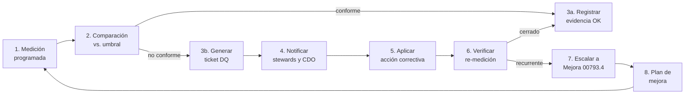
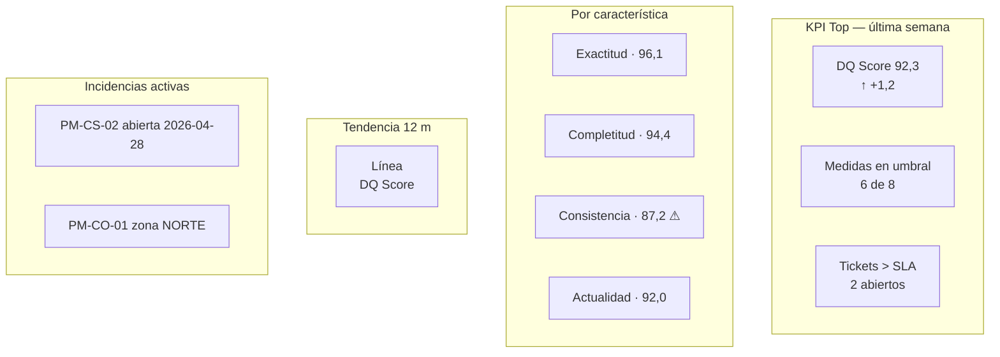

# Proyecto 5 — Control y Monitorización de Calidad del Dato

> **Autor:** Alonso Marcos Muñoz
> **Contexto:** sobre el modelo de calidad y las medidas definidas en P4, EnergiTech necesita implantar un **entorno de monitorización continua** que permita detectar incumplimientos de los umbrales y disparar acciones correctivas antes de que el negocio se vea afectado.
> **Sesión:** 13 — 2026-04-30
> **Procesos UNE 0079 aplicados:** 3.1 Planificación de calidad del dato · 3.2 Control y monitorización de calidad del dato · 3.4 Mejora de calidad del dato (acciones correctivas).

---

## 1. Objetivo y entregable

Operacionalizar el modelo de calidad de P4 en **procedimientos de medición ejecutables**, con responsables, herramientas, frecuencias y acciones correctivas, y proponer un **cuadro de mandos** de calidad.

| ID | Entregable | Ubicación |
|---|---|---|
| E5.1 | Plan de calidad del dato (UNE 0079 3.1) | 4.1 |
| E5.2 | Procedimientos de medición (10 campos por procedimiento) | 4.2 + [`anexos/procedimientos-medicion.md`](anexos/procedimientos-medicion.md) |
| E5.3 | Modelo operativo de control y monitorización (UNE 0079 3.2) | 4.3 |
| E5.4 | Cuadro de mandos de calidad (Nota 9) | 4.4 |
| E5.5 | Flujo de acciones correctivas y ciclo de mejora | 4.5 |

## 2. Criterio de aceptación

- Existe **un procedimiento por cada medida** definida en P4 4.3.
- Cada procedimiento contiene los 10 campos exigidos por el enunciado: característica, dato evaluado, regla, fórmula, frecuencia, herramienta, responsable, umbral, acción correctiva, evidencias.
- El cuadro de mandos define KPIs, audiencia y frecuencia de revisión.
- Las acciones correctivas están enlazadas con el proceso UNE 0079 3.4 (Mejora).

## 3. Marco normativo aplicado

| Apartado | Aporte |
|---|---|
| UNE 0079 3.1 — Planificación de calidad del dato | Define qué medir, sobre qué activos, con qué frecuencia y para qué destinatarios. |
| UNE 0079 3.2 — Control y monitorización de calidad del dato | Define el ciclo medir → comparar → escalar → corregir → registrar. |
| UNE 0079 3.4 — Mejora de calidad del dato | Vincula las no conformidades con acciones correctivas y de mejora continua. |
| UNE 0081 4.4 — Ejecutar la evaluación | Implementación concreta de las medidas declaradas en P4. |
| UNE 0081 4.5 — Finalizar la evaluación | Genera los informes de calidad y la disposición de los resultados. |

---

## 4. Desarrollo

### 4.1 Plan de calidad del dato (UNE 0079 3.1)

| Elemento del plan | Decisión EnergiTech |
|---|---|
| Activos en alcance | `bronze.lectura_smart_meter`, `silver.lectura_smart_meter`, `mdm.cliente_maestro`, `bronze.meteo_zona`, `gold.prevision_demanda`. |
| Modelo de calidad aplicado | El definido en P4 (4 características, 8 medidas). |
| Stakeholders | Operaciones, Comercializadora, CISO/DPO, CTO, CDO, Resp. Calidad. |
| Frecuencia mínima de medición | Diaria para operacionales; semanal para MDM; mensual para auditorías de exactitud. |
| Audiencia de los informes | Cuadro de mandos para CDO + alertas push para *data stewards*. |
| Política de respuesta | Toda no conformidad genera un *ticket DQ* con SLA según severidad. |

### 4.2 Procedimientos de medición

Cada medida de P4 se materializa en un procedimiento que incluye los **10 campos** del enunciado. Resumen:

| Cód. proc. | Característica | Dato evaluado | Frecuencia | Herramienta | Responsable | Severidad |
|---|---|---|---|---|---|---|
| PM-EX-01 | Exactitud sintáctica | `bronze.lectura_smart_meter` | Diaria | OpenMetadata + dbt-tests | *Steward* Operaciones | Alta |
| PM-EX-02 | Exactitud semántica | `silver.lectura_smart_meter` | Mensual | Plan de calibración + Notebook | Resp. Calidad | Crítica |
| PM-CO-01 | Completitud de registros | `silver.lectura_smart_meter` | Diaria | OpenMetadata profiler | *Steward* Operaciones | Alta |
| PM-CO-02 | Completitud atributos *Must* | `mdm.cliente_maestro` | Diaria | OpenMetadata | *Steward* Comercial | Media |
| PM-CS-01 | Consistencia referencial | `crm.contrato`, `red.punto_suministro` | Diaria | dbt-tests `relationships` | Arquitecto del Dato | Alta |
| PM-CS-02 | Consistencia inter-sistema MDM | `mdm.cliente_maestro` ↔ SOR | Semanal | Splink/SparkML + OpenMetadata | Arquitecto del Dato | Crítica |
| PM-AC-01 | Frescura meteo | `bronze.meteo_zona` | Cada hora | Airflow sensor + OpenMetadata | *Steward* Operaciones | Media |
| PM-AC-02 | Frescura telemetría | `bronze.lectura_smart_meter` | Cada hora | Airflow sensor + OpenMetadata | *Steward* Operaciones | Alta |

> Procedimientos completos con los 10 campos en [`anexos/procedimientos-medicion.md`](anexos/procedimientos-medicion.md).

#### 4.2.1 Plantilla del procedimiento

```
Cód: PM-XX-NN
1. Característica de calidad evaluada
2. Dato o conjunto de datos evaluado (referencia al catálogo de datos)
3. Regla / método de medición
4. Fórmula o criterio de cálculo
5. Frecuencia de medición
6. Herramienta utilizada
7. Responsable de ejecución (RACI)
8. Umbral aceptable (referencia P4)
9. Acción correctiva si se incumple el umbral
10. Evidencias generadas (logs, informes, tickets)
```

### 4.3 Modelo operativo de control y monitorización (UNE 0079 3.2)



**Severidad y SLA de respuesta:**

| Severidad | Disparador | SLA respuesta | SLA cierre |
|---|---|---|---|
| Crítica | Medida regulatoria fuera de umbral | < 1 h | < 24 h |
| Alta | Medida operativa fuera de umbral | < 4 h | < 72 h |
| Media | Tendencia degradándose 3 mediciones consecutivas | < 24 h | < 1 semana |
| Baja | Cambios en perfil estadístico (data drift) | < 72 h | < 1 mes |

### 4.4 Cuadro de mandos de calidad del dato (Nota 9)

Audiencia y diseño:

| Vista | Audiencia | Periodicidad | Métricas mostradas |
|---|---|---|---|
| **Resumen ejecutivo** | CDO, Dirección | Mensual | DQ Score global, tendencia 12 m, top 5 incidencias. |
| **Operacional diario** | *Stewards* + Operaciones | Diario | Resultado de cada medida del día anterior, alertas activas. |
| **Vista por dominio** | Resp. de dominio (CRM, Red, Meteo) | Diario | Medidas filtradas por activo, drill-down a registros conflictivos. |
| **Vista regulatoria** | DPO + CISO | Mensual | Conformidad RGPD/ENS, trazabilidad de accesos. |

#### 4.4.1 KPIs propuestos

- **DQ Score global** = media ponderada de las 8 medidas (peso: crítica 3, alta 2, media 1).
- **% de medidas en umbral** = `(medidas conformes / total medidas)`.
- **Tickets DQ abiertos > SLA**.
- **Tasa de reincidencia** = no conformidades repetidas en últimas 4 semanas.
- **Cobertura de stewardship** = % de activos del catálogo con *steward* asignado.

#### 4.4.2 Mockup conceptual del cuadro de mandos



**Herramientas candidatas:**
- **OpenMetadata** (Nota 8) — catálogo + perfiles + tests de calidad.
- **Apache Superset / Power BI / Looker** para la capa de visualización.
- **Great Expectations / dbt-tests** como ejecutores de las reglas en pipeline.
- **Airflow** como orquestador de mediciones programadas.
- **Slack / Teams + ServiceNow** como canal de tickets DQ.

### 4.5 Acciones correctivas y conexión con UNE 0079 3.4 (Mejora)

Cada procedimiento define una **acción correctiva inmediata** y, si la no conformidad se repite, escala al **proceso de mejora**.

| Severidad | Patrón | Acción inmediata | Acción de mejora (si recurrente) |
|---|---|---|---|
| Crítica | Exactitud regulatoria fuera de umbral | Pausar publicación; recalibrar smart-meter en lote afectado. | Programa de calibración periódica con frecuencia ajustada. |
| Alta | Completitud serie < 99 % | Re-extraer del *gateway*; imputar con marca trazable. | Inversión en cobertura red/zona problemática. |
| Alta | Consistencia inter-sistema → caso "Juan Pérez" reaparece | Lanzar pipeline MDM forzado; revisión por *steward*. | Endurecer reglas de matching; involucrar al SOR origen. |
| Media | Frescura meteo > 60 min | Conmutar a proveedor secundario. | Negociar SLA con proveedor o cambiar de proveedor. |
| Cualquiera | Reincidencia 3 + veces | — | Abrir iniciativa de mejora con sponsor (CDO). |

#### 4.5.1 Trazabilidad de no conformidades

Cada ticket registra: `id, medida, valor, umbral, fecha, severidad, causa raíz (5 porqués), acción inmediata, acción de mejora, status, tiempo de cierre, evidencias`. Los datos sirven luego como evidencia para el proceso UNE 0079 3.4 (Mejora) y para la evaluación de madurez (P6).

## 5. Trazabilidad con otros proyectos

| Proyecto | Conexión |
|---|---|
| P1 | Las acciones correctivas pueden generar peticiones de cambio (UNE 0078 3.4 Configuración). |
| P2 | Los resultados se publican en OpenMetadata como metadato operativo de calidad. |
| P3 | PM-CS-02 evalúa el éxito del MDM y orienta sus mejoras. |
| P4 | Cada procedimiento implementa exactamente una medida del modelo. |
| P6 | Evidencia de los procesos UNE 0079 3.1, 3.2, 3.4 implantados. |

## 6. Decisiones y supuestos

- Se elige una pila **OpenMetadata + dbt-tests + Great Expectations + Airflow** por su cobertura completa (catálogo, tests, profilers, orquestación) sin compromiso comercial.
- El cuadro de mandos se publica en **dos niveles** (ejecutivo + operativo) para evitar tanto la opacidad como la fatiga de alertas.
- Las acciones correctivas siguen un esquema **automatizable cuando es posible** (re-extracción, imputación) y manual cuando exige criterio (decisiones de matching).

## 7. Referencias

- UNE 0079:2023 — *Gestión de la Calidad del Dato*. 3.1 Planificación; 3.2 Control y monitorización; 3.4 Mejora.
- UNE 0081:2023 — 4.4 Ejecutar la evaluación; 4.5 Finalizar la evaluación.
- ISO 8000-61:2016 — *Data quality management: Process reference model*.
