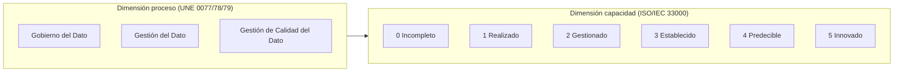
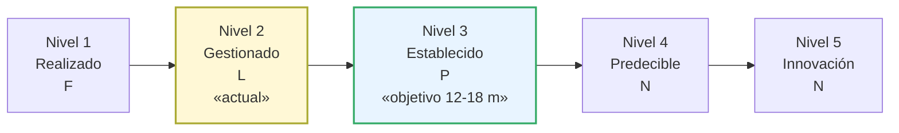
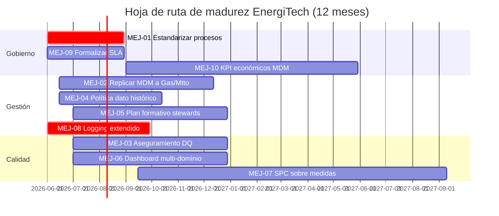

# Proyecto 6 — Evaluación de Madurez Organizacional con UNE 0080

> **Autor:** Alonso Marcos Muñoz
> **Contexto:** EnergiTech ha ejecutado los proyectos P1–P5 utilizando los procesos UNE 0077/0078/0079. Procede ahora una **autoevaluación del nivel de madurez** organizacional usando UNE 0080 y proponer un plan de mejora coherente con la naturaleza de las iniciativas abordadas.
> **Sesión:** 14 — 2026-05-07
> **Especificación aplicada:** UNE 0080:2023 (Guía de evaluación), basada en ISO/IEC 33000 y modelo MAMD.

---

## 1. Objetivo y entregable

Realizar una autoevaluación exploratoria del nivel de madurez de EnergiTech en los procesos de **gobierno**, **gestión** y **gestión de calidad** del dato, derivar el nivel global y construir un **plan de mejora** priorizado.

| ID | Entregable | Ubicación |
|---|---|---|
| E6.1 | Inventario de evidencias por proceso | 4.2 |
| E6.2 | Calificación de capacidad por proceso (escala N/P/L/F) | 4.3 |
| E6.3 | Nivel de madurez organizacional propuesto | 4.4 |
| E6.4 | Plan de mejora detallado | 5 + [`anexos/plan-mejora-madurez.md`](anexos/plan-mejora-madurez.md) |

## 2. Criterio de aceptación

- Cada proceso evaluado declara las **evidencias** generadas durante P1–P5 y su localización en este entregable.
- La calificación usa la escala UNE 0080 2.3.3: **N** (≤ 15 %), **P** (> 15 % – ≤ 50 %), **L** (> 50 % – ≤ 85 %), **F** (> 85 %).
- El nivel global se justifica conforme al modelo MAMD (UNE 0080 4): un nivel `n` requiere que **todos** los procesos del nivel y de los niveles inferiores estén implementados con calificación al menos L.
- El plan de mejora identifica debilidades, acciones, responsables, plazos y beneficios esperados.

## 3. Marco normativo aplicado

| Apartado UNE 0080 | Aporte |
|---|---|
| 2.3 — ISO/IEC 33000 | Modelo de evaluación bidimensional: dimensión proceso × dimensión capacidad. |
| 2.3.2 — Niveles de capacidad | Escala 0–5 (Incompleto / Realizado / Gestionado / Establecido / Predecible / Innovado). |
| 2.3.3 — Atributos de proceso | AP 1.1, AP 2.1, AP 2.2, AP 3.1, AP 3.2, AP 4.1, AP 4.2, AP 5.1, AP 5.2. |
| 3.1, 3.2, 3.3 | Listados de procesos de gobierno (UNE 0077), gestión (UNE 0078) y calidad (UNE 0079). |
| 4 — Modelo MAMD | Niveles 1–5 organizativos con sus conjuntos de procesos. |

---

## 4. Desarrollo

### 4.1 Modelo de evaluación

### 4.2 Inventario de evidencias

| Proceso evaluado | Origen | Evidencia generada en P1–P5 |
|---|---|---|
| **UNE 0078 3.1** Procesamiento del dato | Gestión | Modelo BPMN previsión + catálogo de actividades (P1 4.1). |
| **UNE 0078 3.3** Gestión de requisitos | Gestión | Catálogo y matriz de requisitos ([`matriz-requisitos.md`](anexos/matriz-requisitos.md)). |
| **UNE 0078 3.4** Gestión de configuración | Gestión | Líneas base versionadas en cada anexo (cabeceras *Versión/Fecha*). |
| **UNE 0078 3.7** Gestión del metadato | Gestión | Glosario, catálogo y diccionario poblados (P2 + 3 anexos). |
| **UNE 0078 3.8** Arquitectura y diseño | Gestión | Arquitectura coexistencia + modelos del MDM (P3). |
| **UNE 0078 3.9** Compartición/integración | Gestión | Pipelines Kafka/dbt y API DaaS (P3 4.5). |
| **UNE 0078 3.10** Gestión del dato maestro | Gestión | Modelo MDM Cliente + matching + survivorship (P3 + [`modelo-mdm-cliente.md`](anexos/modelo-mdm-cliente.md)). |
| **UNE 0078 3.12** Ciclo de vida del dato | Gestión | Flujo medallion + controles + políticas (P2 4.3 y 4.4). |
| **UNE 0078 3.6** Seguridad del dato | Gestión | Políticas de pseudonimización, RGPD/ENS (transversal P1, P2). |
| **UNE 0079 3.1** Planificación de DQ | Calidad | Plan de calidad y procedimientos planificados (P5 4.1). |
| **UNE 0079 3.2** Control y monitorización | Calidad | 8 procedimientos de medición + cuadro de mandos (P5 4.2–4.4 + [`procedimientos-medicion.md`](anexos/procedimientos-medicion.md)). |
| **UNE 0079 3.4** Mejora de calidad | Calidad | Acciones correctivas + ciclo de mejora (P5 4.5). |
| **UNE 0077** Gobierno del dato (transversal) | Gobierno | Estructuras (CDO, Resp. Calidad, *stewards*), políticas POL-PII/RET/ACC/USE/DQ (P2 4.4). |

> Procesos **no abordados en el alcance académico**: UNE 0078 3.2 Infraestructura tecnológica (parcial), 3.5 Dato histórico, 3.11 RR.HH., 3.13 Análisis del dato; UNE 0079 3.3 Aseguramiento. Se reflejarán como debilidades en el plan de mejora.

### 4.3 Calificación de la capacidad por proceso

UNE 0080 2.3.3, escala ordinal:

- **N** (No implementado) — 0 % a 15 %
- **P** (Parcialmente implementado) — > 15 % a 50 %
- **L** (Largamente implementado) — > 50 % a 85 %
- **F** (Completamente implementado) — > 85 %

Para alcanzar el **Nivel `n`**, todo proceso debe estar al menos **L** en los atributos de los niveles 1 a `n` y **F** en los niveles 1 a `n−1`.

#### 4.3.1 Calificaciones por proceso (autoevaluación exploratoria)

| Proceso | AP 1.1 (Realización) | AP 2.1 (Gestión) | AP 2.2 (Productos de trabajo) | AP 3.1 (Definición) | AP 3.2 (Despliegue) | AP 4.x (Cuantitativo) | AP 5.x (Innovación) |
|---|:---:|:---:|:---:|:---:|:---:|:---:|:---:|
| 0078 3.1 Procesamiento | F | L | L | P | P | N | N |
| 0078 3.3 Requisitos | F | L | L | P | N | N | N |
| 0078 3.4 Configuración | L | P | P | N | N | N | N |
| 0078 3.6 Seguridad | L | P | P | P | P | N | N |
| 0078 3.7 Metadatos | F | L | L | P | P | N | N |
| 0078 3.8 Arquitectura | F | L | L | P | P | N | N |
| 0078 3.9 Integración | L | P | P | P | N | N | N |
| 0078 3.10 MDM | F | L | L | P | P | N | N |
| 0078 3.12 Ciclo de vida | F | L | L | P | P | N | N |
| 0079 3.1 Planificación DQ | F | L | L | P | P | N | N |
| 0079 3.2 Control DQ | F | L | L | P | P | P | N |
| 0079 3.4 Mejora DQ | L | P | P | N | N | N | N |
| 0077 Gobierno (transversal) | L | P | P | P | N | N | N |

Lectura:
- **AP 1.1** está en F/L para la mayoría de procesos abordados → **Nivel 1 (Realizado)** alcanzado.
- **AP 2.1 y 2.2** están en L para los procesos de Gestión y Calidad → **Nivel 2 (Gestionado)** parcialmente alcanzado.
- **AP 3.1 y 3.2** son P en general (los procesos están descritos en este trabajo pero no han sido sistemáticamente desplegados en toda la organización) → **Nivel 3 no alcanzado**.

### 4.4 Nivel de madurez organizacional propuesto

#### 4.4.1 Modelo MAMD (UNE 0080 4)

| Nivel MAMD | Característica | Procesos exigidos |
|---|---|---|
| 1 — Realizado | Hay evidencia de la realización de procesos básicos. | Procesos núcleo de UNE 0077/78/79. |
| 2 — Gestionado | Los procesos se planifican, supervisan y producen artefactos controlados. | Núcleo + gestión de productos de trabajo. |
| 3 — Establecido | Existe un proceso estándar adoptado en toda la organización. | Procesos del nivel 2 + definición y despliegue. |
| 4 — Predecible | Procesos gestionados con técnicas cuantitativas. | Mediciones cuantitativas y control. |
| 5 — En innovación | Procesos en mejora continua con foco en innovación. | Innovación e implementación. |

#### 4.4.2 Diagnóstico EnergiTech

> **Nivel propuesto: 2 — Gestionado (con elementos hacia el 3 en gestión de calidad).**

Justificación:
- **Nivel 1 (Realizado)** — F: existen evidencias de procesamiento, requisitos, metadatos, arquitectura, MDM, ciclo de vida, control de calidad.
- **Nivel 2 (Gestionado)** — L: los procesos están planificados (P5 4.1), generan artefactos versionados (cabeceras de cada anexo), tienen RACI definido (P5 anexo) y se monitorizan (cuadro de mandos). No alcanza F porque la organización aún ejecuta los procesos en modo proyecto, no como rutina extendida a todas las líneas de negocio.
- **Nivel 3 (Establecido)** — P: la guía está escrita (este entregable es el embrión del proceso estándar) pero el despliegue corporativo no se ha cerrado.
- **Nivel 4 (Predecible)** — N salvo en parte de Calidad: el cuadro de mandos de P5 introduce control cuantitativo, pero cubre solo el dominio de Demanda.
- **Nivel 5 (En innovación)** — N.

## 5. Plan de mejora

### 5.1 Discusión sobre la conveniencia de subir de nivel

EnergiTech opera en un sector **regulado** (energía) con actores muy diversos (regulador CNMC, mercados mayoristas, clientes críticos, ENS) y necesita poder **demostrar** trazabilidad y calidad. Quedarse en el nivel 2 implica seguir ejecutando los procesos por iniciativa de proyecto, vulnerable a rotaciones de equipo y dependencias informales. Subir al **nivel 3 (Establecido)** asegura repetibilidad, auditoría externa y reduce el riesgo legal. La inversión es proporcional al impacto evitado: el caso de duplicidad de "Juan Pérez" multiplicado por 5 millones de clientes es un coste de oportunidad relevante.

**Recomendación:** plan a 12–18 meses para alcanzar el Nivel 3 transversalmente y nivel 4 en los procesos críticos de Calidad (UNE 0079 3.2).

### 5.2 Plan de mejora resumido

| ID | Debilidad detectada | Proceso | Acción recomendada | Prioridad | Responsable | Plazo | Beneficio esperado | Evidencia esperada |
|---|---|---|---|:---:|---|---|---|---|
| MEJ-01 | Procesos descritos solo en alcance del proyecto, no como estándar corporativo. | Transversal | Aprobar este entregable como **proceso estándar** y publicarlo en intranet. | Alta | CDO | 3 meses | Permite alcanzar AP 3.1 en todos los procesos. | Política aprobada por Dirección. |
| MEJ-02 | Despliegue parcial en otros dominios (gas, mantenimiento). | UNE 0078 3.7, 3.10 | Replicar metadatos y MDM al dominio Gas (luego Mantenimiento). | Alta | Arquitecto del Dato | 6 meses | Reduce duplicidades en otros silos. | Glosario y MDM extendidos. |
| MEJ-03 | Aseguramiento de la calidad (UNE 0079 3.3) no implantado. | Calidad | Definir auditorías DQ trimestrales con muestreo estadístico. | Media | Resp. Calidad | 6 meses | Cierra el ciclo Plan-Do-Check-Act. | Plan de auditoría e informes. |
| MEJ-04 | Gestión del dato histórico (UNE 0078 3.5) no abordada. | Gestión | Definir política de retención y archivo frío (post-bronze). | Media | Arquitecto del Dato | 4 meses | Cumplimiento RGPD y reducción coste de almacenamiento. | Política POL-RET-02. |
| MEJ-05 | RR.HH. específico (UNE 0078 3.11) no formalizado. | Gestión | Definir competencias e-CF y plan formativo para *stewards*. | Media | RR.HH. + CDO | 6 meses | Permite alcanzar AP 3.2 (despliegue). | Plan de carrera y formación. |
| MEJ-06 | Cuadro de mandos solo dominio Demanda. | Calidad | Extender el cuadro al dominio Cliente y Red. | Media | Resp. Calidad | 6 meses | Visión 360 de la calidad. | Cuadro multi-dominio. |
| MEJ-07 | No hay análisis cuantitativo de tendencias (AP 4.x). | Calidad | Implementar SPC (Statistical Process Control) sobre las medidas. | Baja | Resp. Calidad | 12 meses | Lleva los procesos críticos al Nivel 4. | Cartas de control + alertas predictivas. |
| MEJ-08 | Trazabilidad de accesos solo en `silver`/`gold`. | Seguridad | Extender logging a todas las capas y al MDM Hub. | Alta | CISO | 4 meses | Cumplimiento ENS y RGPD. | Logs centralizados en SIEM. |
| MEJ-09 | Política de calidad sin acuerdos de servicio (SLA) firmes con *stewards*. | Gobierno | Formalizar SLA por proceso de calidad. | Media | CDO | 3 meses | Refuerza AP 2.1 y AP 3.2. | SLA firmado por dueños. |
| MEJ-10 | Sin medición de retorno de inversión (ROI) del MDM. | Gobierno | Implementar KPI económicos del MDM. | Baja | CDO | 9 meses | Permite priorizar futuras iteraciones. | Informe económico. |

> Plan completo (con recursos, dependencias y diagrama de Gantt) en [`anexos/plan-mejora-madurez.md`](anexos/plan-mejora-madurez.md).

### 5.3 Hoja de ruta visual

## 6. Trazabilidad con otros proyectos

| Proyecto | Conexión |
|---|---|
| P1 | Aporta evidencias de UNE 0078 3.1, 3.3, 3.4. |
| P2 | Aporta evidencias de UNE 0078 3.7 y 3.12. |
| P3 | Aporta evidencias de UNE 0078 3.8, 3.9 y 3.10. |
| P4 | Aporta evidencias de UNE 0079 3.1 y UNE 0081. |
| P5 | Aporta evidencias de UNE 0079 3.1, 3.2, 3.4. |

## 7. Decisiones y supuestos

- La autoevaluación es **exploratoria**: la calificación de cada AP se basa en la presencia de los productos de trabajo en este entregable, no en una auditoría externa.
- El nivel objetivo (Nivel 3 en 12–18 m) es realista para una organización que parte del Nivel 2 con sponsor ejecutivo (CDO).
- Se prioriza la mejora con impacto **regulatorio o de seguridad** (MEJ-01, MEJ-08) por encima de la mejora puramente eficientista.

## 8. Referencias

- UNE 0080:2023 — *Guía de evaluación del Gobierno, Gestión y Gestión de la Calidad del Dato*. Capítulos 2, 3 y 4.
- ISO/IEC 33001:2015 (Conceptos y terminología); ISO/IEC 33002 (Requisitos para realizar la evaluación); ISO/IEC 33020 (Marco de medición de capacidad).
- Modelo MAMD — Modelo Alarcos de Madurez de Datos.
- ISO 8000-62:2018 — *Data quality. Part 62: Process maturity assessment*.
