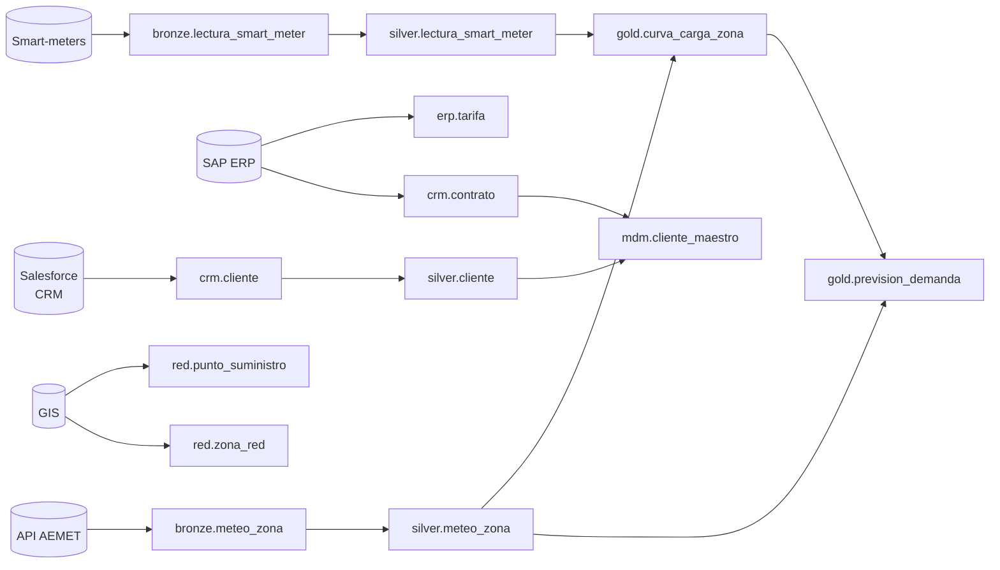

# Anexo — Catálogo de Datos (EnergiTech)

> Producto de trabajo de UNE 0078 3.7.1.4 — *Repositorio del metadato técnico (catálogo de datos) poblado*.
> **Versión:** 1.0 · **Fecha:** 2026-04-09 · **Steward principal:** CTO + Arquitecto del Dato.

## Convenciones

- **Sensibilidad**: `Pública` · `Interna` · `Confidencial` · `Restringida (PII)`.
- **Capa medallion**: `Bronze` (raw) · `Silver` (limpio + pseudonimizado) · `Gold` (agregados).
- Cada activo enlaza con términos del [`glosario-negocio.md`](glosario-negocio.md) y campos del [`diccionario-datos.md`](diccionario-datos.md).

## Activos catalogados

| Activo | Sistema | Esquema.tabla | Capa | Propietario técnico | Steward | Sensibilidad | Frecuencia | Volumen estimado | Lineage upstream |
|---|---|---|---|---|---|---|---|---|---|
| Lecturas smart-meter (raw) | DataLake AWS S3 | `bronze.lectura_smart_meter` | Bronze | CTO | Operaciones | Interna | Streaming 15 min | 10⁹ filas/día | Smart-meters → Kafka |
| Lecturas smart-meter (depuradas) | Lakehouse | `silver.lectura_smart_meter` | Silver | CTO | Operaciones | Interna | Diaria | 10⁹ filas/día | bronze.lectura_smart_meter |
| Cliente CRM | CRM Salesforce | `crm.cliente` | — | Comercializadora | Comercial | Restringida (PII) | Tiempo real (CDC) | 5·10⁶ filas | Salesforce |
| Cliente pseudonimizado | Lakehouse | `silver.cliente` | Silver | CTO | DPO | Confidencial (pseudo) | Diaria | 5·10⁶ filas | crm.cliente |
| Contrato | CRM + ERP | `crm.contrato` | — | Comercializadora | Comercial | Confidencial | Tiempo real | 6·10⁶ filas | Salesforce, SAP |
| Tarifa | ERP SAP | `erp.tarifa` | — | Comercializadora | Comercial | Interna | Diaria | 10³ filas | SAP |
| Punto de suministro | GIS + ERP | `red.punto_suministro` | — | Operaciones | Operaciones | Interna | Semanal | 5·10⁶ filas | GIS, SAP |
| Zona de red | Maestro red | `red.zona_red` | — | Operaciones | Operaciones | Interna | Mensual | 10³ filas | GIS |
| Meteo zona (raw) | API AEMET + S3 | `bronze.meteo_zona` | Bronze | CTO | Operaciones | Pública | Horaria | 10⁵ filas/día | AEMET API |
| Meteo zona depurada | Lakehouse | `silver.meteo_zona` | Silver | CTO | Operaciones | Pública | Diaria | 10⁵ filas/día | bronze.meteo_zona |
| Curva de carga horaria | Lakehouse | `gold.curva_carga_zona` | Gold | CTO | Operaciones | Interna | Diaria | 10⁶ filas | silver.* |
| Producto de datos: Previsión | Plataforma analítica | `gold.prevision_demanda` | Gold | CTO | Operaciones | Interna | Diaria | 10⁵ filas | gold.curva_carga_zona, silver.meteo_zona |
| Logs de acceso | SIEM | `siem.log_accesos` | — | CISO | CISO | Restringida | Tiempo real | 10⁷ eventos/día | Plataforma analítica |
| Maestro Cliente (MDM) | MDM Hub | `mdm.cliente_maestro` | — | Arquitecto del Dato | CDO | Confidencial (pseudo) | CDC | 4·10⁶ filas | crm.cliente, erp.cliente, mantenimiento.cliente |
| Datos de referencia: códigos postales | Maestro común | `ref.codigo_postal` | — | Arquitecto del Dato | Operaciones | Pública | Anual | 10⁴ filas | INE |
| Datos de referencia: tipos de tarifa | Maestro común | `ref.tipo_tarifa` | — | Arquitecto del Dato | Comercial | Pública | Anual | 10² filas | CNMC |

## Mapa de lineage de alto nivel

## Control de cambios

| Versión | Fecha | Cambio | Autor |
|---|---|---|---|
| 1.0 | 2026-04-09 | Línea base con 16 activos del dominio Demanda. | Arquitecto del Dato |
