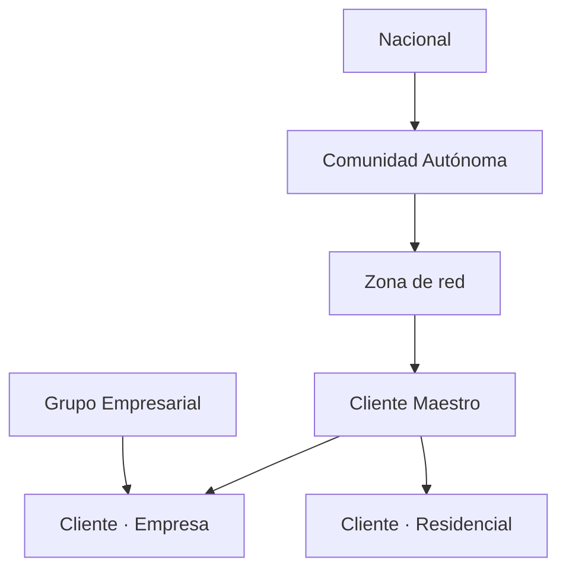

# Anexo — Modelo de Datos Maestros: Cliente

> Producto de trabajo de UNE 0078 3.10.1.4 — *Modelo del dato maestro y sus jerarquías* + *Repositorio del metadato del negocio extendido con la definición y jerarquías del dato maestro*.
> **Versión:** 1.0 · **Fecha:** 2026-04-16 · **Aprobador:** CDO + Arquitecto del Dato.

## 1. Esquema lógico del Cliente Maestro

| # | Atributo | Tipo | Categoría | Fuente preferente | Regla de calidad mínima |
|---:|---|---|---|---|---|
| 1 | `cliente_id_maestro` | UUID | Identificación | Generado por MDM Hub | Único; nunca se reutiliza. |
| 2 | `dni_pseudo` | CHAR(64) | Identificación | CRM (pseudonimización) | Derivado SHA-256 + sal organizativa. |
| 3 | `tipo_documento` | ENUM(`DNI`, `NIE`, `PASAPORTE`, `CIF`) | Identificación | CRM | Coherente con regex del documento. |
| 4 | `nombre_norm` | VARCHAR(80) | Matching | CRM | Sin tildes, mayúsculas, sin caracteres especiales. |
| 5 | `apellidos_norm` | VARCHAR(120) | Matching | CRM | ídem. |
| 6 | `fecha_nacimiento` | DATE | Matching | CRM | Edad ∈ [16, 110]. |
| 7 | `sexo` | ENUM(`F`, `M`, `X`, `ND`) | Descriptivo | CRM | Opcional. |
| 8 | `tipo_cliente` | ENUM(`residencial`, `empresa`, `crítico`) | Descriptivo | Comercializadora | Obligatorio. |
| 9 | `criticidad` | ENUM(`alta`, `media`, `baja`) | Descriptivo | Comercializadora | Default `baja`; aprobado por Operaciones. |
| 10 | `id_grupo_empresarial` | UUID | Jerárquico | ERP SAP | Solo si `tipo_cliente = empresa`. |
| 11 | `idioma_preferido` | VARCHAR(5) | Descriptivo | CRM | Códigos ISO 639-1. |
| 12 | `consentimiento_marketing` | BOOLEAN | Legal | CRM | Trazado con timestamp y base legal. |
| 13 | `estado_maestro` | ENUM(`activo`, `consolidando`, `revision`, `dado_baja`) | Control | MDM Hub | — |
| 14 | `version` | INT | Control | MDM Hub | Incremental. |
| 15 | `fecha_creacion` | TIMESTAMP | Control | MDM Hub | — |
| 16 | `fecha_actualizacion` | TIMESTAMP | Control | MDM Hub | — |

## 2. Entidades asociadas

### `direccion_maestra`

| Atributo | Tipo | Notas |
|---|---|---|
| `id_direccion` | UUID | PK |
| `cliente_id_maestro` | UUID | FK |
| `tipo` | ENUM (`principal`, `facturacion`, `suministro`) | — |
| `direccion_norm` | VARCHAR(255) | Normalizada contra `ref.codigo_postal`. |
| `cp` | CHAR(5) | FK |
| `latitud` / `longitud` | NUMERIC | Geocodificación. |
| `vigente_desde` / `vigente_hasta` | DATE | SCD tipo 2. |

### `contacto_maestro`

| Atributo | Tipo | Notas |
|---|---|---|
| `id_contacto` | UUID | PK |
| `cliente_id_maestro` | UUID | FK |
| `tipo` | ENUM (`email`, `movil`, `fijo`) | — |
| `valor_norm` | VARCHAR(160) | E.164 o RFC 5322. |
| `verificado` | BOOLEAN | Resultado de campaña de verificación. |
| `fecha_ultima_verificacion` | DATE | — |

### `cross_reference`

| Atributo | Tipo | Notas |
|---|---|---|
| `cliente_id_maestro` | UUID | FK |
| `sistema_origen` | ENUM (`CRM_LUZ`, `CRM_GAS`, `MNT`, `ERP`) | — |
| `id_origen` | VARCHAR(40) | Identificador del cliente en el sistema origen. |
| `confianza_match` | NUMERIC(4,3) | [0, 1]. |
| `fecha_consolidacion` | TIMESTAMP | — |

> Relevancia: este enlace es el que **cierra** el problema raíz del enunciado (Juan Pérez con tres `IDCliente`).

## 3. Reglas de matching detalladas

| Atributo | Métrica | Peso (Fellegi-Sunter) | Umbral parcial |
|---|---|---|---|
| DNI exacto | `==` | 0,40 | binario |
| Nombre + Apellidos | Jaro-Winkler | 0,20 | ≥ 0,90 |
| Fecha de nacimiento | exacto (±1 día) | 0,15 | binario |
| Dirección de suministro | Levenshtein normalizado | 0,10 | ≥ 0,85 |
| Email | exacto | 0,10 | binario |
| Teléfono móvil | exacto E.164 | 0,05 | binario |

Score final ∈ [0, 1]. Decisión:
- ≥ 0,92 → auto-merge.
- 0,75 – 0,91 → revisión por *data steward*.
- < 0,75 → no-match.

## 4. Reglas de *survivorship* (golden record)

Tabla resumida en el documento principal 4.2.2. Para cada atributo se documenta:
- **Regla** (más reciente, más completa, regla de negocio).
- **Sistema preferente**.
- **Sistema de respaldo** si la fuente preferente está vacía.

## 5. Calidad mínima del repositorio maestro

Alineada con UNE 0081 (a desarrollar en P4):

| Atributo | Característica | Umbral |
|---|---|---|
| `dni_pseudo` | Completitud | 100 % |
| `tipo_cliente` | Completitud | 100 % |
| `criticidad` | Exactitud (verificable contra Operaciones) | ≥ 95 % |
| Direcciones | Consistencia con `ref.codigo_postal` | 100 % |
| Contactos | Frescura (verificación últimos 24 m) | ≥ 80 % |
| `cliente_maestro` | Unicidad (sin duplicados detectados por matching) | ≥ 99 % |

## 6. Jerarquías

## Control de cambios

| Versión | Fecha | Cambio | Autor |
|---|---|---|---|
| 1.0 | 2026-04-16 | Línea base con modelo conceptual, matching y survivorship. | Arquitecto del Dato |
