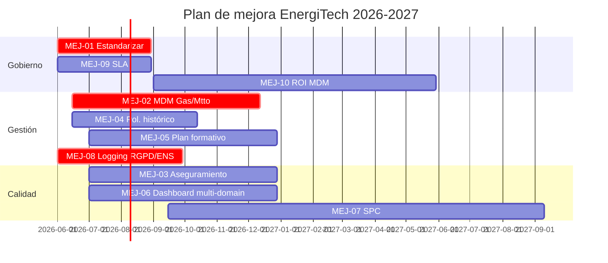

# Anexo — Plan de Mejora de Madurez (UNE 0080)

> Producto del Proyecto 6 — Plan de mejora derivado de la autoevaluación.
> **Versión:** 1.0 · **Fecha:** 2026-05-07 · **Aprobador propuesto:** Comité de Dirección + CDO.

## 1. Objetivo

Llevar a EnergiTech del **Nivel 2 (Gestionado)** al **Nivel 3 (Establecido)** transversalmente y al **Nivel 4 (Predecible)** en los procesos críticos de calidad del dato en un horizonte de **12–18 meses**.

## 2. Iniciativas detalladas

### MEJ-01 · Estandarizar y publicar los procesos como referencia corporativa

| Campo | Valor |
|---|---|
| Debilidad | El alcance del trabajo cubre el dominio Demanda; los procesos no se han adoptado como estándar de toda la organización. |
| Proceso UNE | UNE 0077 §Estrategia + AP 3.1, AP 3.2 transversales. |
| Acción | Aprobar los seis documentos de proyecto como Política y Procedimientos formales. Publicar en intranet. Comunicar a Comité de Dirección y a líneas de negocio (Luz, Gas, Mantenimiento). |
| Prioridad | **Alta** |
| Responsable | CDO |
| Plazo | 3 meses (2026-08) |
| Recursos | 0,5 FTE + presupuesto interno comunicación. |
| Beneficio esperado | Cierra AP 3.1 (Definición del proceso) en todos los procesos. |
| KPI de éxito | % de líneas de negocio que reconocen el estándar; encuesta interna ≥ 80 %. |
| Evidencia | Política firmada; trazabilidad de comunicación. |

### MEJ-02 · Extender el MDM y los metadatos a los dominios Gas y Mantenimiento

| Campo | Valor |
|---|---|
| Debilidad | El MDM Cliente y los repositorios de metadatos solo cubren parcialmente Luz; persisten silos en Gas y Mantenimiento. |
| Proceso UNE | UNE 0078 §3.7, §3.10. |
| Acción | Replicar el patrón aplicado a Demanda (P2 + P3) sobre los dominios Gas y Mantenimiento. |
| Prioridad | Alta |
| Responsable | Arquitecto del Dato + Comercializadora |
| Plazo | 6 meses (2026-12) |
| Recursos | 2 FTE + licencias adicionales OpenMetadata + MDM. |
| Beneficio | Reducir duplicidades inter-silos; el caso "Juan Pérez" deja de existir como problema operativo. |
| KPI | M-CS-02 ≥ 0,98 también en Gas y Mantenimiento. |
| Evidencia | Glosario, catálogo, diccionario y MDM extendidos. |

### MEJ-03 · Implantar el proceso UNE 0079 §3.3 (Aseguramiento de la calidad)

| Campo | Valor |
|---|---|
| Debilidad | Existe Planificación, Control y Mejora pero falta Aseguramiento sistemático. |
| Proceso UNE | UNE 0079 §3.3. |
| Acción | Diseñar e implantar auditorías DQ trimestrales con muestreo estadístico independiente. |
| Prioridad | Media |
| Responsable | Resp. Calidad |
| Plazo | 6 meses (2026-12) |
| Recursos | 0,5 FTE + auditor externo opcional. |
| Beneficio | Cierre del ciclo PDCA; preparación para auditorías externas. |
| KPI | 4 auditorías/año con plan de acción cerrado. |
| Evidencia | Plan de auditoría + informes trimestrales. |

### MEJ-04 · Política de gestión del dato histórico

| Campo | Valor |
|---|---|
| Debilidad | UNE 0078 §3.5 no abordada; las retenciones de bronze/silver/gold están definidas pero no la fase de archivo y borrado. |
| Proceso UNE | UNE 0078 §3.5; RGPD art. 5.1.e (limitación de conservación). |
| Acción | Definir POL-RET-02 que incluya archivo frío (S3 Glacier o equivalente), anonimización irreversible y certificación de borrado. |
| Prioridad | Media |
| Responsable | Arquitecto del Dato + DPO |
| Plazo | 4 meses (2026-10) |
| Recursos | 0,3 FTE. |
| Beneficio | Cumplimiento legal y reducción coste almacenamiento (~30 %). |
| KPI | 100 % de activos con periodo de retención y certificado de borrado. |
| Evidencia | POL-RET-02 publicada; informes trimestrales de cumplimiento. |

### MEJ-05 · Plan formativo y carrera de Data Stewards

| Campo | Valor |
|---|---|
| Debilidad | Roles definidos en RACI pero sin plan formativo formal; competencias e-CF no mapeadas. |
| Proceso UNE | UNE 0078 §3.11. |
| Acción | Mapear competencias e-CF (A.1, A.4, A.5, B.2, D.10, etc.) y diseñar plan formativo + carrera para los *stewards*. |
| Prioridad | Media |
| Responsable | RR.HH. + CDO |
| Plazo | 6 meses (2026-12) |
| Recursos | Presupuesto formación; 0,2 FTE de RR.HH. |
| Beneficio | Permite alcanzar AP 3.2 (Despliegue del proceso). Reduce rotación. |
| KPI | 100 % de *stewards* con plan formativo activo. |
| Evidencia | Matriz de competencias; plan formativo aprobado. |

### MEJ-06 · Cuadro de mandos multi-dominio

| Campo | Valor |
|---|---|
| Debilidad | Cuadro de mandos limitado al dominio Demanda. |
| Proceso UNE | UNE 0079 §3.2. |
| Acción | Extender el cuadro a Cliente (P3), Red y Mantenimiento. Capa semántica común para comparar dominios. |
| Prioridad | Media |
| Responsable | Resp. Calidad + Equipo BI |
| Plazo | 6 meses (2026-12) |
| Recursos | 0,5 FTE BI + licencias Power BI/Superset. |
| Beneficio | Visión 360; permite priorizar mejoras con impacto cruzado. |
| KPI | Adopción semanal por > 50 usuarios distintos. |
| Evidencia | Cuadro disponible; encuesta de adopción. |

### MEJ-07 · Control estadístico de procesos (SPC) sobre las medidas

| Campo | Valor |
|---|---|
| Debilidad | El control es por umbral; no se gestiona la variabilidad estadística (AP 4.1, 4.2). |
| Proceso UNE | UNE 0079 §3.2 con técnicas cuantitativas. |
| Acción | Implementar cartas de control (Shewhart, EWMA) y *anomaly detection* sobre las series de medidas. |
| Prioridad | Baja (mejora hacia Nivel 4) |
| Responsable | Resp. Calidad + Equipo Data Science |
| Plazo | 12 meses (2027-05) |
| Recursos | 1 FTE Data Scientist parcial. |
| Beneficio | Lleva los procesos críticos al Nivel 4 (Predecible). Detección temprana de degradaciones. |
| KPI | Reducción de tickets DQ críticos en un 30 % vs. línea base. |
| Evidencia | Cartas de control y modelo de detección desplegados. |

### MEJ-08 · Trazabilidad de accesos extendida (RGPD/ENS)

| Campo | Valor |
|---|---|
| Debilidad | Logging de accesos solo en capas silver/gold. Bronze y MDM Hub fuera del alcance. |
| Proceso UNE | UNE 0078 §3.6 + ENS + RGPD art. 32. |
| Acción | Centralizar logs en SIEM con retención 12 m y dashboard de accesos a PII. |
| Prioridad | **Alta** (riesgo regulatorio) |
| Responsable | CISO + Arquitecto del Dato |
| Plazo | 4 meses (2026-10) |
| Recursos | 0,5 FTE + licencias SIEM. |
| Beneficio | Cumplimiento ENS; reducción riesgo de sanción. |
| KPI | 100 % de accesos a PII trazados. |
| Evidencia | Logs centralizados; informe DPO trimestral. |

### MEJ-09 · Acuerdos de nivel de servicio (SLA) por proceso de calidad

| Campo | Valor |
|---|---|
| Debilidad | RACI definido pero sin SLA firmes con propietarios de dato. |
| Proceso UNE | UNE 0077 + UNE 0079 §3.1. |
| Acción | Definir y firmar SLA por proceso (tiempo de respuesta, tiempo de cierre, calidad mínima publicable). |
| Prioridad | Media |
| Responsable | CDO |
| Plazo | 3 meses (2026-08) |
| Recursos | 0,2 FTE. |
| Beneficio | Refuerza AP 2.1 y AP 3.2. |
| KPI | 100 % procesos con SLA firmado. |
| Evidencia | SLA archivados. |

### MEJ-10 · Cálculo del retorno de la inversión (ROI) del MDM

| Campo | Valor |
|---|---|
| Debilidad | UNE 0078 §3.10 menciona "calcular el retorno de la inversión en la adopción del dato maestro"; no implantado. |
| Proceso UNE | UNE 0078 §3.10. |
| Acción | Definir KPI económicos: ahorro por reducción de duplicidades, mejora de previsión, reducción de reclamaciones. |
| Prioridad | Baja |
| Responsable | CDO + CFO |
| Plazo | 9 meses (2027-02) |
| Recursos | 0,2 FTE finanzas. |
| Beneficio | Justificar inversiones futuras y orientar prioridades. |
| KPI | Informe trimestral de ROI publicado. |
| Evidencia | Modelo económico + informes. |

## 3. Cronograma global

## 4. Coste estimado

| Concepto | Coste anualizado |
|---|---|
| Personal (≈ 4–5 FTE distribuidos) | 380.000 € |
| Licencias (OpenMetadata Enterprise, MDM, SIEM, BI) | 220.000 € |
| Auditoría externa (MEJ-03) | 30.000 € |
| Formación (MEJ-05) | 40.000 € |
| Total estimado | **≈ 670.000 €** |

> Este coste se contrasta con el coste de oportunidad evitado: reducción de errores de previsión (sobreaprovisionamiento eléctrico), reducción de reclamaciones de clientes y reducción de riesgo regulatorio.

## 5. Indicadores de cierre del plan

| Indicador | Línea base 2026-05 | Objetivo 2027-12 |
|---|---|---|
| Nivel MAMD global | 2 (Gestionado) | 3 (Establecido) |
| Nivel MAMD en Calidad | 2 con elementos de 4 | 4 (Predecible) en procesos críticos |
| DQ Score global | 92,3 | ≥ 95 |
| Cobertura MDM (% clientes consolidados) | 60 % (solo Luz) | ≥ 95 % (todos los dominios) |
| Tickets DQ > SLA | 2 simultáneos | 0 |

## Control de cambios

| Versión | Fecha | Cambio | Autor |
|---|---|---|---|
| 1.0 | 2026-05-07 | Línea base con 10 iniciativas. | CDO |
