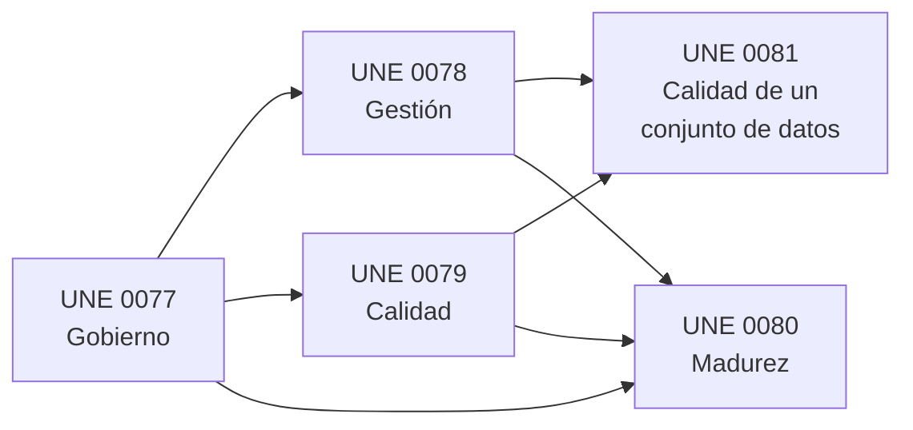
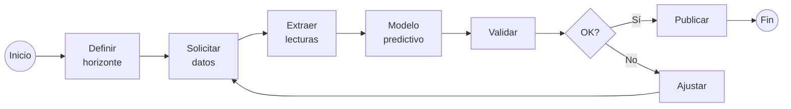
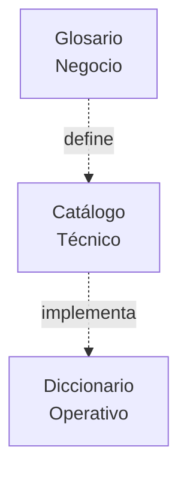
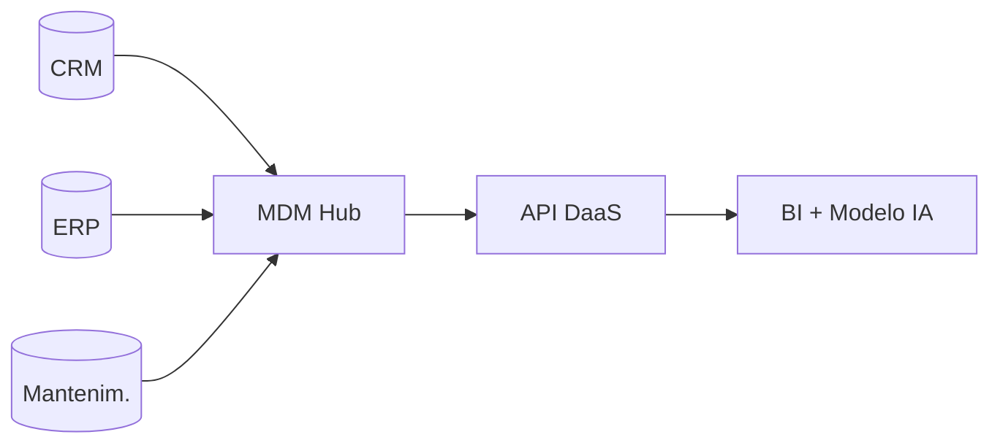
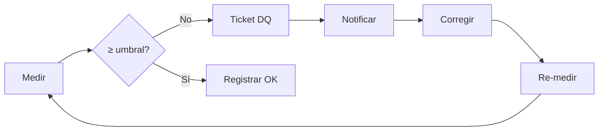
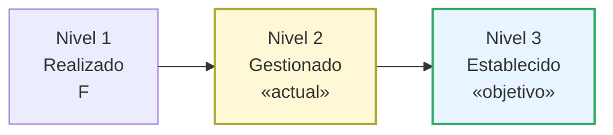

<!-- _class: lead -->

# Gobierno y Calidad del Dato en **EnergiTech**

### Práctica Transversal — Sesiones 9 a 15

**Alonso Marcos Muñoz**

**Caso:** Implantación de procesos UNE 0077/0078/0079/0080/0081
para soportar el sistema de previsión de demanda energética.

Universidad de Castilla-La Mancha · MUBDCN · 2025-26

---

## 1. El problema de EnergiTech

- Multinacional de distribución de energía renovable.
- **Síntomas:** errores en informes y predicciones; clientes duplicados (caso "Juan Pérez" con 3 IDs); sin trazabilidad de accesos a datos sensibles.
- **Causa raíz:** los datos se gestionan en silos, sin estándares ni medición de calidad.
- **Iniciativa:** programa de gobierno del dato basado en las especificaciones UNE.

---

## 2. Marco UNE aplicado



Cada proyecto P1–P6 cubre un subconjunto de procesos.

---

## 3. P1 — Procesamiento del dato y Gestión de Requisitos

**Resultado:** modelo BPMN del cálculo de previsión + matriz de 17 requisitos.



| Tipo | Nº | Ejemplo destacado |
|---|:--:|---|
| Negocio | 4 | RB-01: Previsión 24 h horaria. |
| Dato/Calidad | 9 | RQ-01: Completitud serie ≥ 99 %. |
| Seguridad | 3 | RS-01: Pseudonimización PII (RGPD). |
| Infraestructura | 2 | RI-01: ≥ 10⁹ lecturas/día latencia ≤ 5 min. |

---

## 4. P2 — Metadatos y Ciclo de Vida del Dato

**Tres repositorios reconciliados** + ciclo de vida con controles por etapa.



```mermaid
stateDiagram-v2
  [*] --> Ingesta --> Transformacion --> Almacenamiento --> Explotacion --> [*]
  Almacenamiento --> Retirada --> [*]
```

> Herramienta única: **OpenMetadata** (cubre los tres repositorios y se integra con calidad).

---

## 5. P3 — MDM Cliente y Arquitectura

**Estilo elegido:** *Coexistencia* (hub + bidireccional). Resuelve el caso "Juan Pérez".

- **Identificación**: `dni_pseudo` (SHA-256 + sal).
- **Matching**: nombre + apellidos + fecha-nac + dirección con scoring Fellegi-Sunter.
- **Survivorship**: regla por atributo, sistema preferente declarado.
- **SOR**: CRM Salesforce (cliente), ERP SAP (contrato/tarifa), GIS (CUPS).



---

## 6. P4 — Modelo de Calidad del Dato

**4 características UNE 0081** seleccionadas por su impacto directo en el negocio:

| Característica | Medida principal | Umbral |
|---|---|:--:|
| Exactitud | M-EX-02 desviación lectura vs. patrón | ≤ 2 % |
| Completitud | M-CO-01 lecturas recibidas / esperadas | ≥ 99 % |
| Consistencia | M-CS-02 matching MDM | ≥ 0,98 |
| Actualidad | M-AC-01 frescura meteo | ≤ 60 min |

Cada umbral se justifica frente a un riesgo concreto (regulatorio, operativo o reputacional).

---

## 7. P5 — Control y Monitorización

**8 procedimientos de medición** con los 10 campos exigidos:



**Cuadro de mandos** con 2 niveles (ejecutivo y operativo) en OpenMetadata + Power BI.

| Severidad | SLA respuesta | SLA cierre |
|---|:--:|:--:|
| Crítica (regulatoria) | < 1 h | < 24 h |
| Alta (operativa) | < 4 h | < 72 h |

---

## 8. P6 — Madurez UNE 0080

**Autoevaluación → Nivel 2 (Gestionado)** con elementos hacia el 3.



Atributos AP 1.1 (F), AP 2.1/2.2 (L), AP 3.x (P), AP 4.x (mayoría N) en los procesos abordados.

---

## 9. Plan de mejora — 10 iniciativas

| ID | Acción | Prio. | Plazo |
|---|---|:--:|:--:|
| MEJ-01 | Estandarizar procesos como política corporativa. | A | 3 m |
| MEJ-02 | Replicar MDM y metadatos a Gas y Mantenimiento. | A | 6 m |
| MEJ-08 | Trazabilidad de accesos extendida (RGPD/ENS). | A | 4 m |
| MEJ-03 | Aseguramiento de calidad UNE 0079 §3.3. | M | 6 m |
| MEJ-07 | SPC para llevar Calidad al Nivel 4. | B | 12 m |

> Coste estimado: **~670 k€** anuales · ROI cubierto por reducción de errores de previsión y reclamaciones.

---

## 10. Lecciones aprendidas

- Los procesos UNE son **complementarios**: gobierno (0077) → gestión (0078) → calidad (0079) → evaluación (0080/0081).
- Resolver la **duplicidad de cliente** (MDM) es palanca para casi todas las características de calidad.
- **OpenMetadata** como soporte único reduce el coste de adopción (Notas 4 y 8 del enunciado).
- La medición sin acción no mejora nada: cuadro de mandos + tickets DQ + acciones correctivas → ciclo cerrado.
- Madurez no es un destino: es una **trayectoria** sostenida con sponsor ejecutivo (CDO).

---

## 11. Entregables (Sesión 15)

- Documento maestro por proyecto (`01-…06-…md`).
- Anexos: glosario, catálogo, diccionario, matriz de requisitos, modelo MDM, procedimientos, plan de mejora.
- Diagramas BPMN/arquitectura en Mermaid.
- Esta presentación (Marp).

> Repositorio: `TrabajoGobiernoCalidadDatos/entregable/`

---

<!-- _class: lead -->

# ¿Preguntas?
